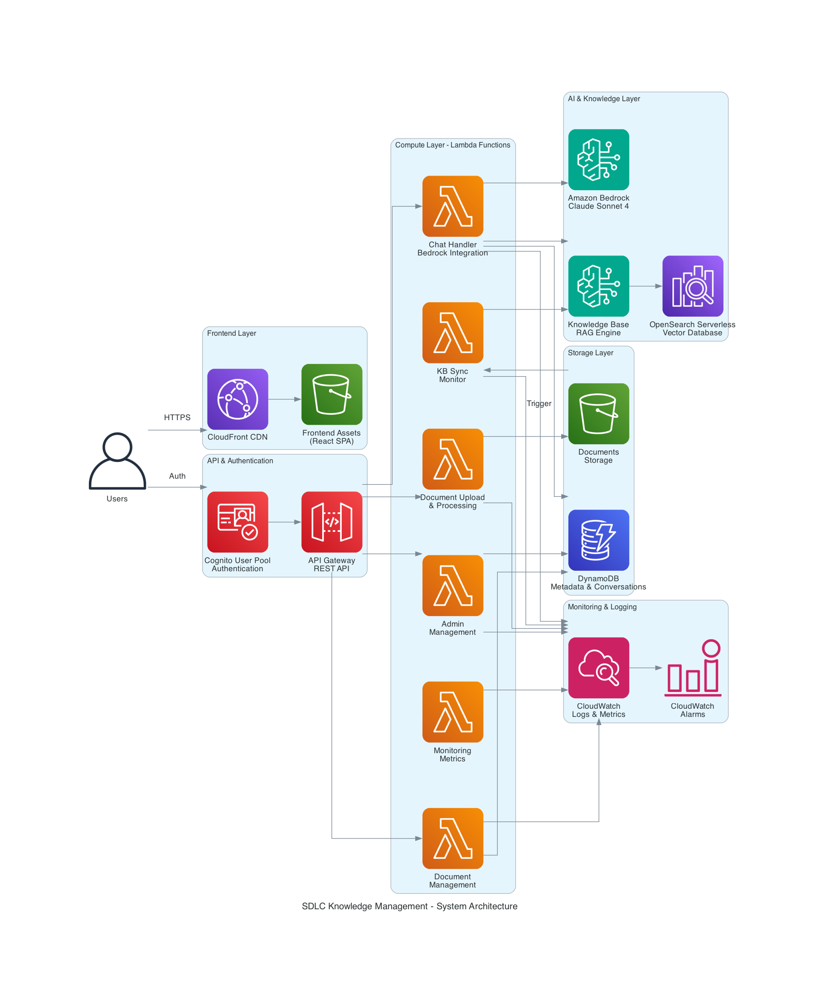
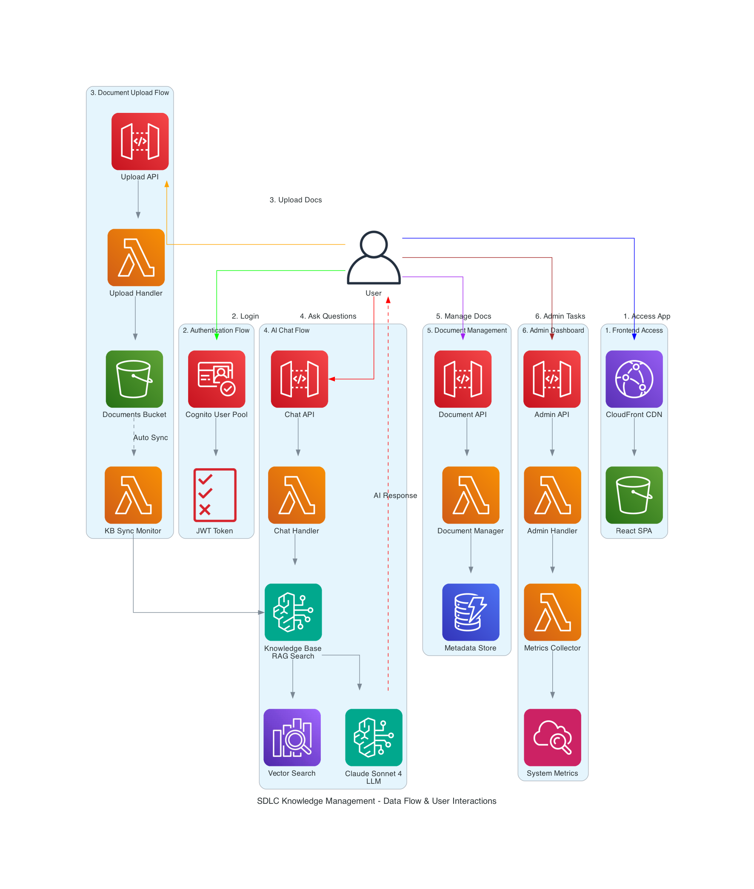
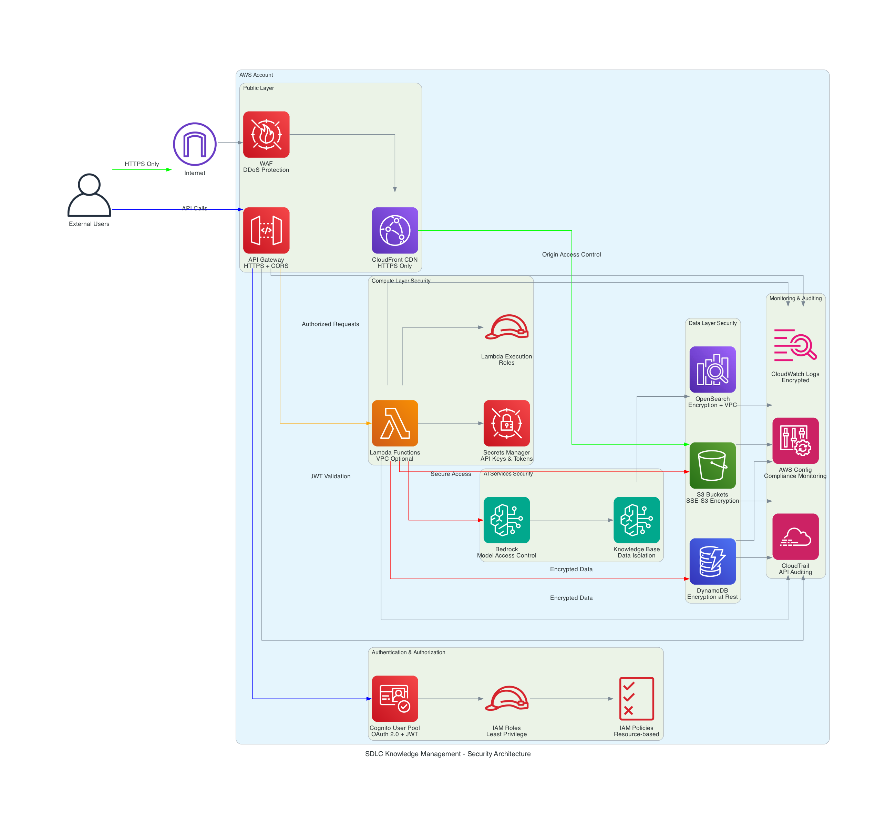
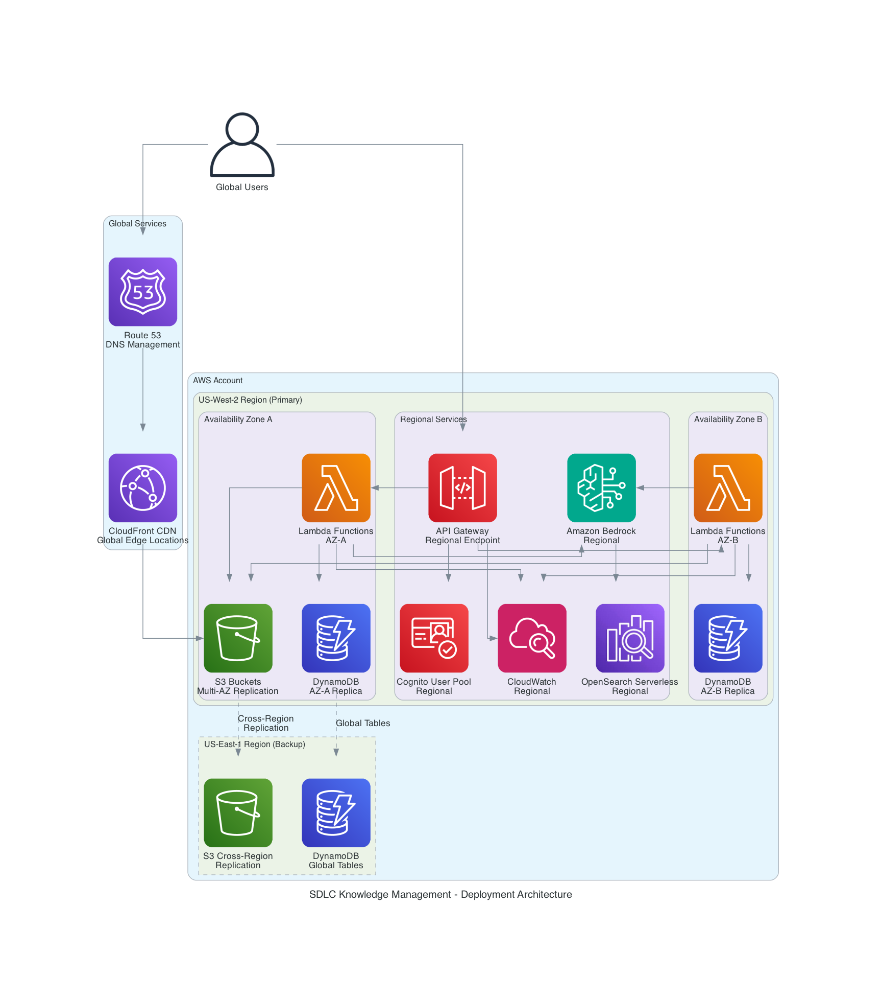

# SDLC Knowledge Management - Architecture Documentation

This document provides comprehensive architecture documentation for the SDLC Knowledge Management system, following AWS architecture diagram best practices and guidelines.

## Architecture Overview

The SDLC Knowledge Management system is built using a modern serverless architecture on AWS, designed for scalability, security, and operational excellence. The system follows AWS Well-Architected Framework principles across all five pillars.

## Architecture Diagrams

### 1. System Architecture


**Purpose**: Shows the complete system architecture with all AWS services and their relationships.

**Key Components**:
- **Frontend Layer**: CloudFront CDN serving React SPA from S3
- **API & Authentication**: API Gateway with Cognito User Pool authentication
- **Compute Layer**: 6 specialized Lambda functions for different responsibilities
- **AI & Knowledge Layer**: Amazon Bedrock with Knowledge Base and OpenSearch Serverless
- **Storage Layer**: S3 for documents, DynamoDB for metadata and conversations
- **Monitoring Layer**: CloudWatch for logs, metrics, and alarms

**Design Principles Applied**:
- ✅ Clear service boundaries and responsibilities
- ✅ Consistent AWS icon usage (latest official icon set)
- ✅ Logical grouping with clusters
- ✅ Left-to-right data flow (user to services)
- ✅ Account boundary clearly depicted

### 2. Data Flow & User Interactions


**Purpose**: Illustrates the six primary user workflows and data movement through the system.

**User Workflows**:
1. **Frontend Access** - Global CDN delivery with React SPA
2. **Authentication Flow** - OAuth 2.0 with JWT tokens via Cognito
3. **Document Upload Flow** - Multi-part upload with automatic Knowledge Base sync
4. **AI Chat Flow** - RAG-powered conversations with source citations
5. **Document Management** - Full CRUD operations with status tracking
6. **Admin Dashboard** - System analytics and user management

**Design Principles Applied**:
- ✅ Top-to-bottom flow showing user journey
- ✅ Color-coded flows for different user interactions
- ✅ Numbered workflow steps for clarity
- ✅ Dashed lines for return/response flows
- ✅ Clear data flow direction with arrows

### 3. Security Architecture


**Purpose**: Details security controls, encryption, and access management across all layers.

**Security Layers**:
- **Public Layer**: CloudFront HTTPS-only, API Gateway with CORS, WAF protection
- **Authentication & Authorization**: Cognito OAuth 2.0, IAM roles with least privilege
- **Compute Security**: Lambda execution roles, Secrets Manager integration
- **Data Security**: S3 SSE-S3 encryption, DynamoDB encryption at rest, OpenSearch VPC
- **AI Services Security**: Bedrock model access control, Knowledge Base data isolation
- **Monitoring & Auditing**: CloudTrail API auditing, CloudWatch encrypted logs, AWS Config

**Design Principles Applied**:
- ✅ AWS account boundary clearly shown
- ✅ Security controls grouped by layer
- ✅ Color-coded security flows
- ✅ Encryption and access controls highlighted
- ✅ Audit trail connections shown

### 4. Deployment Architecture


**Purpose**: Shows regional deployment, availability zones, and disaster recovery setup.

**Deployment Details**:
- **Global Services**: CloudFront edge locations, Route 53 DNS
- **Primary Region**: US-West-2 with multi-AZ deployment
- **Availability Zones**: Lambda functions distributed across AZ-A and AZ-B
- **Regional Services**: API Gateway, Cognito, Bedrock, OpenSearch (regional scope)
- **Cross-Region Backup**: Optional US-East-1 backup with S3 replication and DynamoDB Global Tables

**Design Principles Applied**:
- ✅ Regional and zonal service scopes correctly depicted
- ✅ Multi-AZ deployment shown for high availability
- ✅ Cross-region replication with dashed lines
- ✅ Global vs regional services clearly distinguished
- ✅ Backup/DR components visually differentiated

## Architecture Decisions & Rationale

### Technology Choices

| Component | Technology | Rationale |
|-----------|------------|-----------|
| **Frontend** | React + TypeScript + Vite | Modern development experience, type safety, fast builds |
| **CDN** | CloudFront | Global edge locations, origin access control, cost-effective |
| **API** | API Gateway REST | Managed service, built-in throttling, CORS support |
| **Authentication** | Cognito User Pools | Managed OAuth 2.0, JWT tokens, MFA support |
| **Compute** | Lambda Functions | Serverless, auto-scaling, pay-per-use pricing |
| **AI/ML** | Amazon Bedrock | Managed AI service, Claude Sonnet 4, no infrastructure |
| **Vector Search** | OpenSearch Serverless | Managed vector database, automatic scaling |
| **Document Storage** | S3 | Unlimited storage, versioning, lifecycle policies |
| **Metadata Storage** | DynamoDB | NoSQL, single-digit millisecond latency, auto-scaling |
| **Monitoring** | CloudWatch | Native AWS integration, custom metrics, alerting |

### Design Patterns

#### 1. Microservices Architecture
- **6 specialized Lambda functions** for different responsibilities
- **Single responsibility principle** - each function has one clear purpose
- **Loose coupling** - functions communicate via API Gateway and shared storage
- **Independent deployment** - each function can be updated independently

#### 2. Event-Driven Architecture
- **S3 event triggers** for automatic Knowledge Base synchronization
- **CloudWatch Events** for scheduled monitoring tasks
- **API Gateway integration** for synchronous request/response patterns
- **Asynchronous processing** for document upload and processing

#### 3. Security by Design
- **Defense in depth** - multiple security layers
- **Least privilege access** - IAM roles with minimal permissions
- **Encryption everywhere** - data encrypted at rest and in transit
- **Zero trust model** - every request authenticated and authorized

#### 4. Observability First
- **Structured logging** - JSON logs with correlation IDs
- **Custom metrics** - business and technical metrics in CloudWatch
- **Distributed tracing** - request tracking across services
- **Proactive monitoring** - alarms and automated responses

## Performance Characteristics

### Response Time Targets
- **Chat API Response**: < 10 seconds (95th percentile)
- **Document Upload**: < 5 minutes for processing
- **Search Queries**: < 2 seconds for document retrieval
- **Frontend Load**: < 200ms via CloudFront CDN
- **API Gateway**: < 100ms for authentication

### Scalability Limits
- **Concurrent Users**: 1000+ simultaneous users supported
- **Document Storage**: Unlimited via S3
- **Vector Database**: Auto-scaling OpenSearch Serverless
- **Lambda Concurrency**: 1000 concurrent executions per function
- **API Rate Limits**: Configurable throttling per user/API key

### Cost Optimization
- **Serverless Architecture**: Pay-per-use pricing model
- **S3 Intelligent Tiering**: Automatic cost optimization for storage
- **DynamoDB On-Demand**: Pay for actual read/write capacity
- **Lambda Provisioned Concurrency**: Only for high-traffic functions
- **CloudFront Caching**: Reduced origin requests and costs

## Security Implementation

### Authentication & Authorization
```
User Request → CloudFront → API Gateway → Cognito JWT Validation → Lambda Function
```

### Data Encryption
- **In Transit**: HTTPS/TLS 1.2+ for all communications
- **At Rest**: 
  - S3: SSE-S3 encryption
  - DynamoDB: Encryption at rest with AWS managed keys
  - OpenSearch: Encryption at rest and in transit
  - Lambda: Environment variables encrypted with KMS

### Network Security
- **CloudFront**: HTTPS-only, custom SSL certificates
- **API Gateway**: CORS configuration, request validation
- **Lambda**: VPC configuration optional (currently public subnet)
- **OpenSearch**: VPC-only access, security groups

### Access Control
- **IAM Roles**: Least privilege principle
- **Resource-based Policies**: S3 bucket policies, Lambda resource policies
- **Cognito User Pools**: User management, MFA support
- **API Keys**: Rate limiting and usage tracking

## Monitoring & Observability

### CloudWatch Metrics
- **Custom Business Metrics**: Chat sessions, document uploads, user activity
- **Technical Metrics**: Lambda duration, API Gateway latency, error rates
- **Cost Metrics**: Service usage and billing alerts
- **Performance Metrics**: Response times, throughput, availability

### Logging Strategy
- **Structured Logging**: JSON format with correlation IDs
- **Log Aggregation**: CloudWatch Logs with retention policies
- **Error Tracking**: Centralized error logging and alerting
- **Audit Logging**: CloudTrail for API calls and resource changes

### Alerting & Notifications
- **CloudWatch Alarms**: Threshold-based alerting
- **SNS Integration**: Email and SMS notifications
- **Lambda Dead Letter Queues**: Failed execution handling
- **Custom Dashboards**: Real-time system health monitoring

## Disaster Recovery & Business Continuity

### Backup Strategy
- **S3 Cross-Region Replication**: Automatic backup to US-East-1
- **DynamoDB Point-in-Time Recovery**: 35-day backup retention
- **Lambda Function Versioning**: Code version management
- **Infrastructure as Code**: Terraform for environment recreation

### High Availability
- **Multi-AZ Deployment**: Lambda functions across availability zones
- **Auto-Scaling**: Automatic capacity adjustment
- **Health Checks**: API Gateway and CloudWatch monitoring
- **Failover Procedures**: Documented recovery processes

### Recovery Time Objectives (RTO)
- **Frontend**: < 5 minutes (CloudFront cache)
- **API Services**: < 15 minutes (Lambda cold start)
- **Database**: < 30 minutes (DynamoDB recovery)
- **Full System**: < 1 hour (complete environment recreation)

## Compliance & Governance

### AWS Well-Architected Framework
- **Operational Excellence**: Infrastructure as Code, monitoring, automation
- **Security**: Defense in depth, encryption, access control
- **Reliability**: Multi-AZ, auto-scaling, error handling
- **Performance Efficiency**: Serverless, caching, optimization
- **Cost Optimization**: Pay-per-use, resource right-sizing

### Data Governance
- **Data Classification**: Public, internal, confidential data handling
- **Retention Policies**: Automated lifecycle management
- **Access Logging**: Complete audit trail of data access
- **Privacy Controls**: User data isolation and deletion capabilities

## Future Architecture Considerations

### Scalability Enhancements
- **API Gateway Caching**: Response caching for improved performance
- **Lambda Provisioned Concurrency**: For high-traffic endpoints
- **DynamoDB Global Tables**: Multi-region active-active setup
- **ElastiCache Integration**: Redis caching layer

### Security Improvements
- **VPC Endpoints**: Private connectivity to AWS services
- **AWS WAF Rules**: Advanced threat protection
- **GuardDuty Integration**: Threat detection and response
- **Secrets Rotation**: Automated credential management

### Operational Enhancements
- **X-Ray Tracing**: Distributed request tracing
- **Container Migration**: ECS/Fargate for long-running processes
- **Step Functions**: Complex workflow orchestration
- **EventBridge**: Advanced event routing and processing

---

## Diagram Maintenance

These architecture diagrams are maintained using the AWS MCP Diagram Server and follow the [AWS Architecture Diagram Guidelines](https://dev.to/aws-builders/aws-architecture-diagrams-guidelines-595d).

**Update Process**:
1. Modify diagram code using AWS MCP tools
2. Regenerate diagrams with consistent AWS icons
3. Update this documentation
4. Review with architecture team
5. Commit changes to version control

**Last Updated**: December 2024
**Diagram Version**: 2.0
**AWS Icon Set**: Latest official AWS architecture icons