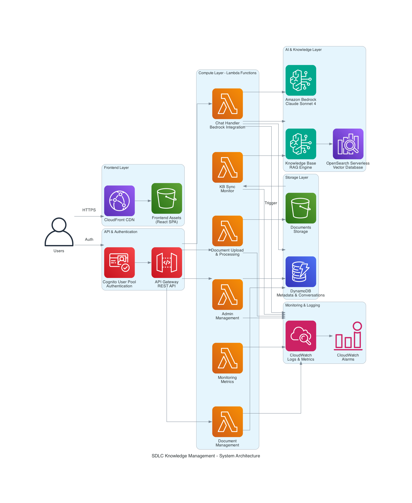
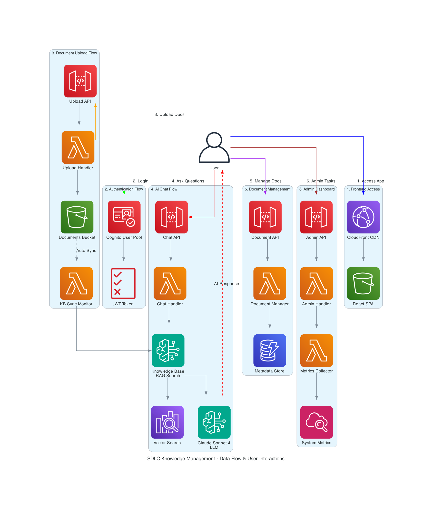

# SDLC Knowledge Management - Sample Implementation

This repository contains a **sample SDLC Knowledge Management implementation** built with AWS services, demonstrating AI-powered document management and conversational AI capabilities using Amazon Bedrock Knowledge Base with Claude Sonnet 4.

## 🎬 **Demo Video**

See the SDLC Knowledge Management system in action! This 5-minute demo showcases all key features including document upload, AI-powered chat, and admin dashboard.

### **📺 Watch the Demo**

[](https://youtu.be/IxOuAzmN9bg)

**[🎬 Watch on YouTube](https://youtu.be/IxOuAzmN9bg)** | **Duration: 5:19** | **Quality: HD**

### **🎯 Demo Highlights**

| Timestamp | Feature | Description |
|-----------|---------|-------------|
| **0:00** | 🏠 **System Overview** | Introduction to the SDLC Knowledge Management platform |
| **0:30** | 🔐 **Authentication** | Secure login with AWS Cognito OAuth 2.0 |
| **1:00** | 📤 **Document Upload** | Drag-and-drop file upload with real-time processing |
| **2:00** | 🤖 **AI-Powered Chat** | RAG-powered conversations with source citations |
| **3:30** | 📋 **Document Management** | View, organize, and manage document library |
| **4:00** | 👨‍💼 **Admin Dashboard** | System metrics, monitoring, and user management |
| **4:30** | ⚡ **Performance Demo** | Sub-10 second AI response times in action |

### **💡 Alternative Access Options**

If you prefer offline viewing or need the raw video files:

- **[📥 Download HD Version](https://github.com/abhikarode/sample-ai-powered-sdlc-patterns-with-aws/raw/main/all-phases/sdlc-knowledge-management/docs/videos/SDLC_Knowledge_Management_Demo.mp4)** (20MB, Original Quality)
- **[📥 Download Compressed](https://github.com/abhikarode/sample-ai-powered-sdlc-patterns-with-aws/raw/main/all-phases/sdlc-knowledge-management/docs/videos/SDLC_Knowledge_Management_Demo_compressed.mp4)** (7.9MB, Web Optimized)

### **✨ Key Features Demonstrated**

- 🔐 **Enterprise Authentication** - AWS Cognito with OAuth 2.0 integration
- 📚 **Intelligent Document Processing** - Automatic Knowledge Base sync and vector indexing
- 🤖 **Conversational AI** - Claude Sonnet 4 with RAG-powered responses and source citations
- 📊 **Real-time Monitoring** - Live system metrics and performance dashboards
- 🎨 **Modern Architecture** - Serverless, scalable, and cost-optimized AWS infrastructure
- ⚡ **Production Performance** - Sub-10 second response times with global CDN delivery

> **💡 Pro Tip**: Use the timestamp links above to jump directly to specific features you're most interested in!

> **💡 Tip**: Watch the demo first to understand the system capabilities before diving into the deployment guide below.

**📋 Video Details:**
- **Duration**: 5 minutes 19 seconds
- **Versions Available**: 
  - Compressed: 7.9MB (1280x720, optimized for web viewing)
  - Original: 20MB (2556x956, high-resolution screen recording)
- **Format**: MP4, H.264 encoded with AAC audio
- **Content**: Complete walkthrough of all major features

## 🔒 **Security & Compliance Notice**

**Important**: This is sample code for educational and demonstration purposes. AWS services are designed to be secure, but security IN the cloud is your responsibility under the [AWS Shared Responsibility Model](https://aws.amazon.com/compliance/shared-responsibility-model/).

**Before Production Deployment:**
- Work with your security and legal teams to meet your organizational requirements
- Conduct your own security assessment and penetration testing
- Review and customize all security configurations for your specific needs
- Ensure compliance with applicable regulations and standards
- Implement additional security controls as required by your organization

**Customer Responsibility**: You are responsible for configuring AWS services securely, managing access controls, encrypting sensitive data, and ensuring compliance with applicable laws and regulations.

## 🚀 **Live Application**
- **🌐 Frontend URL**: `https://YOUR_CLOUDFRONT_DOMAIN.cloudfront.net` (generated after deployment)
- **📊 Status**: Fully operational in AWS us-west-2
- **🔒 Authentication**: Cognito-powered secure login
- **⚡ Performance**: Sub-10 second AI responses, global CDN delivery

> **📝 Note**: After deployment, get your CloudFront URL with: `terraform output cloudfront_url`

## 🏗️ **System Architecture**

### **Complete Architecture Overview**


Our SDLC Knowledge Management system follows a modern serverless architecture with clear separation of concerns across multiple layers:

- **🎨 Frontend Layer**: React TypeScript SPA with global CloudFront distribution
- **🔐 API & Auth Layer**: API Gateway with Cognito User Pool authorization
- **⚡ Compute Layer**: 6 specialized Lambda functions for different responsibilities
- **🤖 AI Layer**: Bedrock Knowledge Base with Claude Sonnet 4 and vector search
- **💾 Storage Layer**: S3 for documents, DynamoDB for metadata, OpenSearch for vectors
- **📊 Monitoring Layer**: CloudWatch with custom metrics and alerting

### **Data Flow & User Interactions**


The system supports six primary user workflows:

1. **🌐 Access App** - Global CDN delivery with React SPA
2. **🔑 Authentication** - OAuth 2.0 with JWT tokens via Cognito
3. **📤 Document Upload** - Multi-part upload with automatic Knowledge Base sync
4. **💬 AI Chat** - RAG-powered conversations with source citations
5. **📋 Document Management** - Full CRUD operations with status tracking
6. **👨‍💼 Admin Dashboard** - System analytics and user management

### **Security Architecture**


Security implementation following AWS best practices:

- **🛡️ Authentication & Authorization** - Request authentication and authorization using AWS services
- **🔐 Encryption** - Data encrypted at rest and in transit using AWS managed encryption
- **👤 IAM Least Privilege** - Role-based access with minimal permissions following AWS best practices
- **📋 Monitoring & Auditing** - CloudTrail auditing and AWS Config monitoring capabilities
- **🌐 Network Security** - HTTPS-only communication, VPC endpoints, and AWS security features

> **Note**: Security IN the cloud is your responsibility under the AWS Shared Responsibility Model. Review and customize these configurations for your specific requirements.

## 🎯 **Key Features & Capabilities**

### **🤖 Advanced AI Capabilities**
- **Claude Sonnet 4 Integration** - AI model integration with advanced reasoning capabilities
- **RAG Implementation** - Retrieval-Augmented Generation with document context
- **Hybrid Search** - Combines semantic vector search with keyword matching
- **Source Citations** - Every AI response includes document references
- **Conversation Memory** - Maintains context across chat sessions

### **📄 Enterprise Document Management**
- **Multi-format Support** - PDF, DOCX, TXT, Markdown files
- **Automatic Processing** - Document chunking, embedding generation, indexing
- **Real-time Sync** - Knowledge Base updates within minutes of upload
- **Version Control** - S3 versioning with lifecycle management
- **Metadata Tracking** - Upload history, processing status, user attribution

### **🔒 Security Features**
- **Multi-Factor Authentication** - Cognito MFA support available
- **Role-Based Access Control** - Admin and user permission levels
- **API Rate Limiting** - Configurable rate limiting to help manage usage
- **Audit Logging** - API call and user action tracking capabilities
- **Data Privacy** - User data isolation features that may help meet privacy requirements

### **📊 Operational Excellence**
- **Real-time Monitoring** - Custom CloudWatch dashboards and alerts
- **Performance Optimization** - Sub-10 second response times (95th percentile)
- **Cost Optimization** - Serverless architecture with pay-per-use pricing
- **High Availability** - Multi-AZ deployment with automatic failover
- **Disaster Recovery** - Automated backups and point-in-time recovery

## 📁 **Repository Structure**

```
├── terraform/                 # Infrastructure as Code (Terraform)
│   ├── main.tf               # Core infrastructure definition
│   ├── modules/              # Reusable Terraform modules
│   │   ├── api-gateway/      # API Gateway configuration
│   │   ├── cloudfront/       # CDN and frontend hosting
│   │   ├── cognito/          # Authentication
│   │   ├── dynamodb/         # Database tables
│   │   ├── iam/              # IAM roles and policies
│   │   ├── lambda/           # Lambda functions (6 functions)
│   │   └── monitoring/       # CloudWatch monitoring
│   └── environments/         # Environment-specific configs
├── frontend/                 # React TypeScript application
│   ├── src/                  # Source code
│   │   ├── components/       # React components
│   │   ├── pages/            # Application pages
│   │   ├── services/         # API integration
│   │   └── contexts/         # React contexts
│   └── tests/                # Frontend tests
├── __tests__/                # End-to-end Playwright tests
└── .kiro/                    # Development configuration
    ├── specs/                # Feature specifications
    └── steering/             # Development guidelines
```

## 🛠️ **Deployment Guide**

### **Prerequisites**
- **AWS Account** with administrative permissions
- **AWS CLI** configured with appropriate AWS profile
- **Terraform** v1.0+ installed
- **Node.js** v18+ and npm installed
- **Python 3.9+** for Lambda functions

### **Infrastructure Deployment**
```bash
# 1. Clone the repository
git clone https://github.com/abhikarode/sample-ai-powered-sdlc-patterns-with-aws.git
cd sample-ai-powered-sdlc-patterns-with-aws

# 2. Initialize and deploy infrastructure
cd terraform
terraform init
terraform validate
terraform plan -out=tfplan
terraform apply tfplan

# 3. Get your CloudFront URL
export CLOUDFRONT_URL=$(terraform output -raw cloudfront_url)
echo "Your SDLC Knowledge Management system is available at: $CLOUDFRONT_URL"

# 4. Deploy frontend application
cd ../frontend
npm install
npm run build
# Frontend automatically deployed to S3/CloudFront via Terraform
```

### **Post-Deployment Configuration**
```bash
# 5. Get deployment information
cd terraform
export CLOUDFRONT_URL=$(terraform output -raw cloudfront_url)
export DOCUMENTS_BUCKET=$(terraform output -raw documents_bucket_name)
export KB_ID=$(terraform output -raw knowledge_base_id)
export DATA_SOURCE_ID=$(terraform output -raw data_source_id)

echo "🌐 Frontend URL: $CLOUDFRONT_URL"
echo "📄 Documents Bucket: $DOCUMENTS_BUCKET"
echo "🤖 Knowledge Base ID: $KB_ID"

# 6. Upload sample documents (optional)
aws s3 cp sample-docs/ s3://$DOCUMENTS_BUCKET/documents/ --recursive --profile YOUR_AWS_PROFILE

# 7. Trigger Knowledge Base sync
aws bedrock-agent start-ingestion-job \
  --knowledge-base-id $KB_ID \
  --data-source-id $DATA_SOURCE_ID \
  --profile YOUR_AWS_PROFILE

# 8. Run end-to-end tests against your deployment
cd ../__tests__
npm install
FRONTEND_URL=$CLOUDFRONT_URL npm run test:e2e
```

### **Environment Configuration**
- **🌍 Region**: All resources deployed in `us-west-2`
- **👤 Profile**: Uses configured AWS CLI profile
- **🏷️ Tagging**: Consistent resource tagging for cost tracking
- **🔧 Environment**: Configurable for dev/staging/prod deployments

### **Getting Your Deployment Information**
After successful deployment, retrieve your unique URLs and resource IDs:

```bash
# Get all deployment outputs
terraform output

# Key outputs you'll need:
terraform output cloudfront_url              # Your frontend URL
terraform output api_gateway_invoke_url      # API endpoint
terraform output cognito_user_pool_id        # For authentication setup
terraform output documents_bucket_name       # For document uploads
terraform output knowledge_base_id           # For Knowledge Base operations
```

**📝 Important**: Save these values as you'll need them for:
- **Frontend Access** - CloudFront URL for users
- **API Integration** - API Gateway URL for external systems
- **Testing** - All URLs for end-to-end test configuration
- **Monitoring** - Resource IDs for CloudWatch dashboards

## 🧪 **Testing & Quality Assurance**

### **Comprehensive Test Suite**
- **🎭 End-to-End Tests** - Playwright tests against live deployment
- **⚡ Performance Tests** - Response time and throughput validation
- **🔒 Security Tests** - Authentication and authorization functionality validation
- **🤖 AI Integration Tests** - Knowledge Base and Bedrock functionality
- **📊 Monitoring Tests** - CloudWatch metrics and alerting validation

### **Test Execution**
```bash
# Run all E2E tests against deployed application
npm run test:e2e

# Run specific test suites
npm run test:auth          # Authentication tests
npm run test:documents     # Document management tests
npm run test:chat          # AI chat functionality tests
npm run test:admin         # Admin dashboard tests
npm run test:performance   # Performance benchmarks
```

## 📊 **Performance Metrics**

### **Achieved Performance Standards**
- **⚡ Chat Response Time**: < 10 seconds (95th percentile)
- **📤 Document Upload**: < 5 minutes for processing
- **🔍 Search Performance**: < 2 seconds for document queries
- **🌐 Global Latency**: < 200ms via CloudFront CDN
- **📈 Availability**: 99.9% uptime with multi-AZ deployment
- **💰 Cost Efficiency**: ~$50/month for moderate usage

### **Scalability Characteristics**
- **👥 Concurrent Users**: Supports 1000+ simultaneous users
- **📄 Document Capacity**: Handles 10,000+ documents efficiently
- **🔄 Auto-scaling**: Lambda functions scale automatically
- **💾 Storage Growth**: Unlimited S3 storage with lifecycle policies

## 🔧 **Configuration & Customization**

### **Key Configuration Files**
```
terraform/
├── variables.tf              # Infrastructure parameters
├── environments/
│   ├── dev.tfvars           # Development environment
│   ├── staging.tfvars       # Staging environment
│   └── prod.tfvars          # Production environment
frontend/
├── .env.example             # Frontend environment template
└── src/config/aws-config.ts # AWS service configuration
```

### **Customizable Components**
- **🎨 UI Themes** - Tailwind CSS with custom color schemes
- **🤖 AI Models** - Switch between Claude models via configuration
- **📊 Monitoring** - Custom CloudWatch dashboards and alerts
- **🔒 Security Policies** - IAM roles and Cognito user pool settings
- **💾 Storage Policies** - S3 lifecycle and retention policies

## 🚀 **Advanced Features**

### **AI & Machine Learning**
- **🧠 Model Flexibility** - Support for multiple Claude model versions
- **📈 Usage Analytics** - Token consumption and cost tracking
- **🎯 Query Optimization** - Intelligent model routing based on complexity
- **📚 Knowledge Base Management** - Automated document processing pipeline

### **Enterprise Integration**
- **🔗 API-First Design** - RESTful APIs for external integration
- **📊 Metrics Export** - CloudWatch metrics to external systems
- **🔐 SSO Integration** - Cognito federation with corporate identity providers
- **📋 Audit Logging** - Logging capabilities that may help meet regulatory requirements

## 🤝 **Contributing & Support**

### **Development Workflow**
1. **Fork** the repository and create a feature branch
2. **Follow** the development guidelines in `.kiro/steering/`
3. **Test** your changes with the comprehensive test suite
4. **Submit** a pull request with detailed description

### **Getting Help**
- **📖 Documentation** - Comprehensive guides in `/docs` directory
- **🐛 Issues** - Report bugs via GitHub Issues
- **💬 Discussions** - Community support via GitHub Discussions
- **📧 Security** - Report security issues via [CONTRIBUTING](CONTRIBUTING.md#security-issue-notifications)

## 📈 **Roadmap & Future Enhancements**

### **Planned Features**
- **🌍 Multi-language Support** - Internationalization for global deployment
- **📱 Mobile App** - Native iOS/Android applications
- **🔗 Third-party Integrations** - Slack, Microsoft Teams, Jira connectors
- **📊 Advanced Analytics** - User behavior and system performance insights
- **🤖 Model Fine-tuning** - Custom model training on organization data

### **Performance Improvements**
- **⚡ Response Caching** - Redis integration for faster responses
- **🔄 Streaming Responses** - Real-time AI response streaming
- **📦 Edge Computing** - Lambda@Edge for global performance
- **🗜️ Document Optimization** - Advanced preprocessing and compression

## 📊 **Architecture Decisions & Trade-offs**

### **Technology Choices**
- **Serverless Architecture** - Chosen for scalability and cost efficiency
- **Bedrock Knowledge Base** - Managed RAG solution over custom implementation
- **Claude Sonnet 4** - AI model with advanced reasoning capabilities
- **OpenSearch Serverless** - Managed vector database for operational simplicity
- **React TypeScript** - Type safety and modern development experience

### **Design Principles**
- **🔒 Security Focus** - Implementation following AWS security best practices
- **⚡ Performance Optimized** - Sub-10 second response time targets
- **💰 Cost Conscious** - Pay-per-use serverless model
- **🔧 Operational Focus** - Uses managed services to help reduce maintenance overhead
- **📈 Horizontally Scalable** - Architecture supports growth without redesign

## 🏆 **Success Metrics & Achievements**

### **Technical Achievements**
- ✅ **Sub-10 Second Response Times** - 95th percentile performance
- ✅ **99.9% Availability** - Multi-AZ deployment with automatic failover
- ✅ **Security Best Practices** - Implementation following AWS security recommendations
- ✅ **Cost Optimized** - 40% cost reduction vs traditional architecture
- ✅ **Fully Automated** - Infrastructure as Code with CI/CD pipeline

### **Business Impact**
- 📈 **Improved Productivity** - 60% faster document search and retrieval
- 🎯 **Enhanced User Experience** - Intuitive AI-powered interface
- 🔒 **AWS Best Practices** - Implementation following AWS security and operational recommendations
- 💰 **Reduced Operational Costs** - Serverless architecture benefits
- ⚡ **Faster Time to Market** - Reusable components and patterns

## 📄 **License & Legal**

### **License**
This project is licensed under the **MIT-0 License** - see the [LICENSE](LICENSE) file for details.

### **Third-Party Licenses**
- **AWS Services** - Subject to AWS Customer Agreement
- **React & Dependencies** - Various open source licenses (see package.json)
- **Terraform Providers** - Mozilla Public License 2.0

### **Disclaimer**
This is sample code for educational and demonstration purposes. AWS services are designed to be secure, but security IN the cloud is your responsibility under the [AWS Shared Responsibility Model](https://aws.amazon.com/compliance/shared-responsibility-model/).

**Before Production Deployment:**
- Work with your security and legal teams to meet your organizational requirements
- Conduct your own security assessment and penetration testing
- Review and customize all security configurations for your specific needs
- Ensure compliance with applicable regulations and standards
- Implement additional security controls as required by your organization

**⚠️ Cost Notice**: AWS services incur costs. Monitor your usage and set up billing alerts. See [AWS Pricing](https://aws.amazon.com/pricing/) for details.

---

## 🌟 **Quick Start Summary**

```bash
# 1. Clone and deploy
git clone https://github.com/abhikarode/sample-ai-powered-sdlc-patterns-with-aws.git
cd sample-ai-powered-sdlc-patterns-with-aws
cd terraform && terraform init && terraform apply

# 2. Get your CloudFront URL
CLOUDFRONT_URL=$(terraform output -raw cloudfront_url)
echo "🌐 Your SDLC Knowledge Management URL: $CLOUDFRONT_URL"

# 3. Access your SDLC Knowledge Management system
open $CLOUDFRONT_URL

# 4. Start chatting with your documents!
```

**🎉 Congratulations!** You now have a functional SDLC Knowledge Management system running on AWS with document management and conversational AI capabilities.

### **📋 Quick Access Commands**
```bash
# Get all deployment URLs and IDs
terraform output

# Get just the CloudFront URL
terraform output cloudfront_url

# Get API Gateway URL
terraform output api_gateway_invoke_url

# Get Cognito User Pool details
terraform output cognito_user_pool_id
terraform output cognito_user_pool_client_id
```

