# MCP OpenAPI Documentation Server

## Introduction

This project provides a Model Context Protocol (MCP) server for AI-powered OpenAPI documentation generation. The solution enables developers and AI assistants to generate standardized OpenAPI specifications, analyze business domains, and produce comprehensive API documentation using Amazon Bedrock and AWS Lambda services.

### 🎯 Overview

This repository contains an MCP server that provides AI-powered OpenAPI documentation generation capabilities:

- **MCP Server Implementation** with HTTP transport and JSON-RPC 2.0 compliance
- **Domain Analysis Tools** for business requirement processing using AWS Lambda
- **OpenAPI Generation** using Amazon Bedrock agents for standards-compliant specifications
- **Documentation Generation** with comprehensive API documentation and examples
- **AWS Deployment** with ECS Fargate, ALB, and containerized architecture

## Solution Architecture

### Available Tools

The MCP server provides three main tools accessible via JSON-RPC 2.0:

1. **`domain_analysis`**: Analyze business domains and generate domain models using AWS Lambda
2. **`generate_documentation`**: Generate API documentation and OpenAPI specifications using AWS Lambda
3. **`generate_openapi_spec`**: Generate OpenAPI 3.1 specifications using Amazon Bedrock agents

### AWS Architecture Overview


### Application Architecture Overview

```mermaid
graph TB
    subgraph "🤖 MCP Client"
        Client[AI Assistant<br/>or MCP Client]
    end
    
    subgraph "🌐 MCP Server (ECS)"
        ALB[Application Load Balancer<br/>HTTP/HTTPS]
        MCP[MCP HTTP Server<br/>JSON-RPC 2.0]
        Tools[MCP Tools<br/>domain_analysis<br/>generate_documentation<br/>generate_openapi_spec]
    end
    
    subgraph "🤖 AI/ML Services"
        Bedrock[Amazon Bedrock<br/>Claude 3.7 Sonnet]
        Agent[Bedrock Agent<br/>OpenAPI Generation]
    end
    
    subgraph "🔄 Processing Layer"
        DomainLambda[Domain Analyzer<br/>Lambda Function]
        DocLambda[Documentation Generator<br/>Lambda Function]
    end
    
    subgraph "💾 Storage Layer"
        S3[S3 Bucket<br/>Domain Models & Analysis]
    end
    
    Client --> ALB
    ALB --> MCP
    MCP --> Tools
    Tools --> DomainLambda
    Tools --> DocLambda
    Tools --> Agent
    DomainLambda --> Bedrock
    DocLambda --> Bedrock
    Agent --> Bedrock
    DomainLambda --> S3
    DocLambda --> S3
    
    style Client fill:#e1f5fe
    style MCP fill:#fff3e0
    style Bedrock fill:#fff3e0
    style S3 fill:#f3e5f5
```



## 📁 Project Structure

```
mcp-openapi-documentation/
├── 📂 mcp-server/                # MCP server implementation
│   ├── 🌐 HTTP server with JSON-RPC 2.0
│   ├── 🛠️ Three main MCP tools
│   ├── 🐳 Docker containerization
│   └── 🧪 Development and testing scripts
│   └── 📖 [README.md](mcp-server/README.md) - Server setup and RunPod deployment
├── 📂 cdk/                       # AWS CDK infrastructure
│   ├── 🏗️ ECS Fargate deployment
│   ├── 🔄 Application Load Balancer
│   ├── 📋 VPC and networking setup
│   ├── 📊 OpenSearch vector index setup
│   └── 📖 [README.md](cdk/README.md) - Infrastructure deployment and configuration
├── 📂 doc-gen-lambda/            # Documentation generation service
├── 📂 domain-analyzer-lambda/    # Domain analysis service
├── 📂 shared/                    # Shared utilities and types
│   └── 📖 [README.md](shared/README.md) - JWT authentication middleware
├── 📜 deploy-all.sh              # Main deployment script
└── 📖 [DEPLOYMENT_GUIDE.md](DEPLOYMENT_GUIDE.md) - Comprehensive deployment guide
```

### 📚 Documentation Index

| Component | Purpose | Documentation |
|-----------|---------|---------------|
| **Main Project** | Overview and quick start | This README |
| **MCP Server** | Server implementation and RunPod deployment | [mcp-server/README.md](mcp-server/README.md) |
| **Infrastructure** | AWS CDK deployment and configuration | [cdk/README.md](cdk/README.md) |
| **Authentication** | JWT middleware for Lambda functions | [shared/README.md](shared/README.md) |
| **Deployment** | Step-by-step deployment instructions | [DEPLOYMENT_GUIDE.md](DEPLOYMENT_GUIDE.md) |

### 🔗 Component Integration

The project components work together as follows:

1. **[MCP Server](mcp-server/README.md)** - The main HTTP server that implements the MCP protocol and can be deployed either locally with Docker/Podman or on RunPod for cloud hosting
2. **[CDK Infrastructure](cdk/README.md)** - AWS deployment infrastructure that creates ECS services, Lambda functions, and all supporting AWS resources with comprehensive environment variable configuration
3. **[Shared Authentication](shared/README.md)** - JWT middleware used by Lambda functions to authenticate requests using AWS Cognito, ensuring secure access to backend services
4. **[Deployment Guide](DEPLOYMENT_GUIDE.md)** - Orchestrates the entire deployment process, from AWS infrastructure setup to MCP server configuration

**Deployment Flow**: Start with the [Deployment Guide](DEPLOYMENT_GUIDE.md) → Configure infrastructure with [CDK](cdk/README.md) → Deploy [MCP Server](mcp-server/README.md) → Lambda functions use [Shared Auth](shared/README.md)

## 📋 Prerequisites

- **Node.js**: 18+ (for MCP server development)
- **AWS CLI**: v2+ (for deployment) - run `aws configure` first
- **AWS CDK**: v2+ (for infrastructure) - install with `npm install -g aws-cdk`
- **Docker**: For container building and deployment (or Podman)
- **jq**: Recommended for JSON manipulation (optional)

## 🚀 Deployment

### Quick start

**The easiest way to deploy everything:**

```bash
# Deploy with access from your current IP (recommended)
./deploy-all.sh --my-ip

# OR deploy with public access (⚠️ less secure)
./deploy-all.sh --allowed-ips "0.0.0.0/0"
```

> **⚠️ Security Note**: Running `./deploy-all.sh` without IP restrictions will make your ALB **inaccessible**. You must specify either `--my-ip` or `--allowed-ips` for the server to be reachable.

### 🛠️ Advanced Deployment Options

```bash
# Basic deployment (most common)
./deploy-all.sh --my-ip

# Deploy with specific IP restrictions
./deploy-all.sh --allowed-ips "192.168.1.1/32,10.0.0.0/24"

# Deploy with HTTPS using existing certificate
./deploy-all.sh --my-ip --certificate-arn "arn:aws:acm:region:account:certificate/cert-id"

# Deploy only the MCP server stack (if other stacks already exist)
./deploy-all.sh --my-ip --mcp-server-only

# Deploy multiple ECS tasks for high availability
./deploy-all.sh --my-ip --desired-count 2
```

### Optional: Environment Configuration

You can optionally create a `.env` file in the `cdk/` directory to set deployment defaults:

```bash
# Create optional deployment configuration
cd cdk
cat > .env << EOF
AWS_REGION=us-east-1
CDK_DEFAULT_REGION=us-east-1
EOF
cd ..
```

**Note**: Command-line arguments will override any values set in the `.env` file.

### Local Development

```bash
cd mcp-server

# Setup development environment
./scripts/setup-podman-dev.sh

# Start MCP server locally
./scripts/podman-dev.sh start

# Test the server
./scripts/podman-dev.sh test
```

### Manual Docker Image Management

```bash
# Build and push to ECR (after MCP Server Stack is deployed)
./push-to-ecr.sh --force-build

# Build and push to ECR with specific ECR URI
./push-to-ecr.sh --ecr-uri YOUR_ECR_URI --region eu-west-1

# Build for a specific platform
./push-to-ecr.sh --platform linux/amd64
```

### 🔧 Quick Troubleshooting

**Common Issues:**

| Problem | Solution |
|---------|----------|
| `AWS credentials not configured` | Run `aws configure` and enter your credentials |
| `CDK is not installed` | Run `npm install -g aws-cdk` |
| `Docker not found` | Install Docker or use `--skip-image-push` flag |
| `Permission denied` | Make sure script is executable: `chmod +x deploy-all.sh` |
| `ALB inaccessible` | Check your IP with `curl https://checkip.amazonaws.com` and redeploy with `--allowed-ips "YOUR_IP/32"` or use `--allowed-ips "0.0.0.0/0"` for public access |

**Need help?** Check the detailed [Deployment Guide](DEPLOYMENT_GUIDE.md) or component-specific READMEs.

### Deployment Process

The deployment process follows these steps:

1. **Bootstrap CDK Environment**: Sets up the AWS CDK environment
2. **Deploy MCP Server Stack**: Creates the ECR repository and ECS infrastructure
3. **Build and Push Docker Image**: Builds and pushes the MCP server image to ECR
4. **Deploy Additional Stacks**: Deploys OpenSearch, Storage, Bedrock, and Lambda stacks
5. **Create Vector Index**: Creates the OpenSearch vector index
6. **Update ECS Service**: Sets the desired task count for the ECS service
7. **Update Environment Variables**: Creates a .env file with deployment outputs

## 🤖 Testing

Test the MCP server functionality:

```bash
# Test MCP server endpoints
cd mcp-server
./scripts/podman-dev.sh test

# Test individual tools
curl -X POST http://localhost:3001/mcp \
  -H "Content-Type: application/json" \
  -d '{
    "jsonrpc": "2.0",
    "id": 1,
    "method": "tools/list",
    "params": {}
  }'
```

### 🤖 MCP Tools and Capabilities

This MCP server provides three main tools accessible via JSON-RPC 2.0:

#### Available Tools

**🔍 `domain_analysis`**
- **Purpose**: Analyze business domains and generate domain models
- **Backend**: AWS Lambda with Amazon Bedrock
- **Input**: Business descriptions, domain contexts, analysis depth
- **Output**: Structured domain analysis with entities, relationships, and insights

**📋 `generate_documentation`**
- **Purpose**: Generate comprehensive API documentation
- **Backend**: AWS Lambda with Amazon Bedrock
- **Input**: Domain models, API types (REST/GraphQL/gRPC), security requirements
- **Output**: OpenAPI specifications and markdown documentation

**⚡ `generate_openapi_spec`**
- **Purpose**: Generate OpenAPI 3.1 specifications from requirements
- **Backend**: Amazon Bedrock Agent with streaming responses
- **Input**: API information, domain analysis, business context
- **Output**: Standards-compliant OpenAPI 3.1 specifications with validation

#### MCP Protocol Features

- ✅ **HTTP Transport**: JSON-RPC 2.0 over HTTP for easy integration
- ✅ **Tool Discovery**: Dynamic tool listing and schema validation
- ✅ **Error Handling**: Comprehensive error responses and logging
- ✅ **Health Monitoring**: Built-in health checks and readiness endpoints

## 🔍 Key Features

### MCP Server Capabilities

| Feature | Description | Implementation |
|---------|-------------|----------------|
| **HTTP Transport** | JSON-RPC 2.0 over HTTP | Express.js server with CORS support |
| **Tool Registry** | Dynamic tool discovery | Automatic schema validation |
| **AWS Integration** | Lambda and Bedrock services | IAM roles and VPC endpoints |
| **Containerization** | Docker deployment | ECS Fargate with ALB |

### Modern Deployment Practices

- ✅ **Container Architecture**: Podman-built images with x86_64 support
- ✅ **Infrastructure as Code**: AWS CDK with TypeScript
- ✅ **Serverless Integration**: AWS Lambda for AI processing
- ✅ **Security First**: VPC isolation, IAM roles, and IP restrictions
- ✅ **High Availability**: ECS Fargate with Application Load Balancer

### 📈 MCP Integration Benefits

| Aspect | Traditional API | MCP Server Approach | Benefit |
|--------|----------------|-------------------|---------|
| **Integration** | Custom API clients | Standard MCP protocol | Universal compatibility |
| **Discovery** | Manual documentation | Dynamic tool discovery | Self-documenting |
| **Validation** | Custom validation | JSON Schema validation | Type safety |
| **Error Handling** | Inconsistent responses | Standardized JSON-RPC errors | Better debugging |

### 📈 Performance Improvements

| Metric | Traditional Approach | AI-Powered Approach | Improvement |
|--------|---------------------|-------------------|-------------|
| **Design Time** | 2-4 weeks | 2-4 hours | 90% faster |
| **Documentation** | Manual creation | Auto-generated | 95% time savings |
| **Consistency** | Variable quality | Standardized output | 100% compliance |
| **Iteration Speed** | Days per change | Minutes per change | 99% faster |

### 🛡️ Security Features

- **Network Isolation**: VPC with private subnets and VPC endpoints
- **Access Control**: Application Load Balancer with IP restrictions
- **IAM Integration**: Least-privilege roles for Lambda and ECS tasks
- **Container Security**: Rootless containers with non-root user
- **Data Protection**: Encryption in transit and at rest for all AWS services

### 🚀 Deployment Architecture

| Component | Service | Purpose | Configuration |
|-----------|---------|---------|---------------|
| **MCP Server** | ECS Fargate | HTTP server hosting | Container with health checks |
| **Load Balancer** | Application LB | Traffic routing | IP restrictions and SSL |
| **AI Processing** | AWS Lambda | Domain analysis | Bedrock integration |
| **Container Registry** | Amazon ECR | Image storage | Podman-built x86_64 images |

### 📊 Monitoring and Observability

- **Health Endpoints**: `/health` and `/ready` endpoints for monitoring
- **CloudWatch Logs**: Structured logging with request correlation
- **ECS Metrics**: Container insights and performance monitoring  
- **ALB Metrics**: Request/response metrics and error tracking
- **Cost Optimization**: Fargate spot pricing and resource right-sizing

### 🔗 MCP Client Integration

To use this MCP server with an AI assistant or MCP client:

```json
{
  "server_id": "openapi-mcp-server",
  "endpoint_url": "http://your-alb-url",
  "transport": "http",
  "capabilities": [
    "domain_analysis",
    "generate_documentation", 
    "generate_openapi_spec"
  ]
}
```
## 🧹Clean up

### Option 1: Comprehensive Cleanup Script (Recommended)

Use the automated cleanup script to remove all AWS resources and local files:

```bash
# Complete cleanup with confirmation prompt
./cleanup-all-resources.sh

# Skip confirmation prompt
./cleanup-all-resources.sh --confirm

# Also delete ECR images and S3 content
./cleanup-all-resources.sh --confirm --delete-ecr-images --delete-s3-content
```

This script will remove:
- ✅ All CDK stacks (McpServerStack, LambdaAPIStack, BedrockStack, OpenSearchStack)
- ✅ ECS services and tasks
- ✅ Application Load Balancer and VPC resources
- ✅ S3 buckets (emptied before deletion)
- ✅ ECR repositories and images (if specified)
- ✅ Local deployment files and artifacts

### Option 2: Manual CDK Cleanup

Alternatively, you can use the AWS CDK CLI directly:

```bash
# Navigate to the CDK directory
cd cdk

# Destroy specific stacks
cdk destroy McpServerStack
cdk destroy LambdaAPIStack
cdk destroy BedrockStack
cdk destroy OpenSearchStack

# Or destroy all stacks at once
cdk destroy --all
```

You may also need to manually delete:
- ECR images
- S3 bucket contents
- CloudWatch log groups

## 🔐 Security

See CONTRIBUTING for more information

## 📄 License

This library is licensed under the MIT-0 License. See the [LICENSE](LICENSE) file.

## Disclaimer

The solution architecture sample code is provided without any guarantees, and you're not recommended to use it for production-grade workloads. The intention is to provide content to build and learn. Be sure of reading the licensing terms."

---

Built with ❤️ using the AWS, MCP, Amazon Bedrock, and AI-powered SDLC.