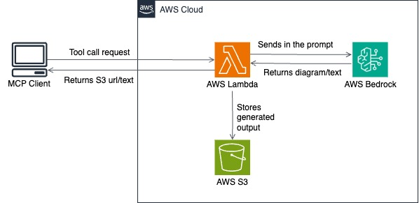

# AWS Architecture Design MCP Server

## 1. Introduction

A comprehensive Model Context Protocol (MCP) server that provides AI-powered AWS architecture design tools. Generate diagrams, analyze architectures, create infrastructure code, and get expert AWS guidance - all through a secure, authenticated API.

The MCP server provides 4 core tools for AWS architecture design:
- **Query AWS Knowledge**: Get expert guidance from the AWS Well-Architected Framework
- **Create Architecture Diagram**: Generate visual AWS architecture diagrams as PNG images
- **Generate Architecture Code**: Generate Infrastructure as Code templates
- **Analyze Architecture**: Analyze architectures against AWS best practices

## 2. Solution Architecture

### System Architecture



### Data Flow
1. **Client Request**: MCP client sends authenticated request
2. **Lambda Processing**: Function validates and routes request
3. **Tool Execution**: Appropriate tool processes the request
4. **AI Processing**: Bedrock generates responses using Claude 3.7 Sonnet
5. **Asset Storage**: Diagrams stored in S3 with unique URLs
6. **Response**: Structured response returned to client

### What Gets Created in Your Account

The CDK deployment creates these resources in **your AWS account**:

| Resource | Purpose | Cost Impact |
|----------|---------|-------------|
| **Lambda Function** | MCP server with 10GB memory | ~$0.20 per 1M requests |
| **S3 Buckets (3)** | Diagrams, logs, CloudTrail | ~$0.023 per GB/month |
| **IAM Roles** | Lambda execution, cross-account | No cost |
| **CloudTrail** | Security audit logging | ~$2.00 per 100K events |
| **Function URL** | HTTPS endpoint with IAM auth | No additional cost |

**Estimated monthly cost for light usage: $5-15/month**

### Supported AWS Services
The server includes mappings for 554+ AWS services including:
- **Compute**: EC2, Lambda, ECS, Fargate, Batch
- **Storage**: S3, EBS, EFS, FSx
- **Database**: RDS, DynamoDB, ElastiCache, Redshift
- **Networking**: VPC, CloudFront, API Gateway, ALB/NLB
- **Security**: IAM, Cognito, WAF, KMS, Secrets Manager
- **Analytics**: Kinesis, EMR, Glue, Athena
- **Machine Learning**: SageMaker, Bedrock, Comprehend
- **Management**: CloudWatch, CloudTrail, Config, Systems Manager

## 3. Prerequisites

Before deploying the MCP server, ensure you have:

### Required Software
- **Python 3.11+** - Runtime environment
- **AWS CLI v2** - Configured with appropriate credentials
- **AWS CDK v2** - For infrastructure deployment
- **Docker** - For containerized Lambda deployment
- **Node.js 18+** - Required by CDK

### AWS Account Requirements
- **AWS Account** with administrative access
- **Bedrock Access** - Claude 3.7 Sonnet model enabled
- **S3 Bucket** - For storing generated diagrams
- **Lambda Permissions** - For function deployment

### Install Prerequisites
```bash
# Install AWS CLI
curl "https://awscli.amazonaws.com/awscli-exe-linux-x86_64.zip" -o "awscliv2.zip"
unzip awscliv2.zip && sudo ./aws/install

# Install AWS CDK
npm install -g aws-cdk@latest

# Configure AWS credentials
aws configure
```

## 4. Deployment instructions

### Quick Start

#### Pre-Deployment Checklist
- [ ] AWS CLI configured with admin permissions (`aws configure`)
- [ ] Bedrock Claude 3.7 Sonnet access enabled
- [ ] CDK v2 installed (`npm install -g aws-cdk@latest`)
- [ ] Python 3.11+ and Docker installed

#### 1. Clone and Setup
```bash
git clone https://github.com/aws-samples/aws-architecture-design-mcp-server.git
cd aws-architecture-design-mcp-server
python -m venv .venv
source .venv/bin/activate  # Windows: .venv\Scripts\activate
```

#### 2. Verify AWS Configuration
```bash
# Verify your AWS credentials are configured
aws sts get-caller-identity

# Test region detection
aws configure get region
echo $CDK_DEFAULT_REGION
```

##### How Auto-Detection Works
The CDK automatically detects your AWS account and region using your existing credentials in this order:

1. **Environment Variables:**
   ```bash
   export AWS_ACCESS_KEY_ID=your-access-key
   export AWS_SECRET_ACCESS_KEY=your-secret-key
   export AWS_DEFAULT_REGION=us-east-1
   ```

2. **AWS CLI Configuration:**
   ```bash
   # Created by: aws configure
   ~/.aws/credentials
   ~/.aws/config
   ```

3. **IAM Roles (if running on AWS):**
   - EC2 instance profiles
   - Lambda execution roles
   - ECS task roles

4. **AWS SSO/Identity Center:**
   ```bash
   aws sso login --profile my-profile
   ```

##### If Auto-Detection Fails
Common issues and solutions:
- **No credentials configured**: Run `aws configure`
- **Expired credentials**: Re-run `aws configure` or `aws sso login`
- **Wrong profile**: Set `export AWS_PROFILE=your-profile`
- **No internet**: Check your connection

#### 3. Deploy Infrastructure
```bash
cd cdk
pip install -r requirements.txt

# Optional: Set your preferred region (defaults to us-east-1 for Bedrock)
export CDK_DEFAULT_REGION=us-east-1

cdk bootstrap  # First time only
cdk deploy     # Automatically detects your account and region

# For automated deployments without prompts:
cdk deploy --require-approval never
```

**What happens during deployment:**
```bash
$ cdk deploy
🚀 Deploying to Account: [YOUR-ACCOUNT-ID], Region: us-east-1
✨ Synthesis time: 5.23s
MCPArchitectureServer: deploying...
```

The CDK will:
- Auto-detect your AWS account ID using `aws sts get-caller-identity`
- Use your configured region from AWS CLI or environment variables
- Show account/region for confirmation before deploying

#### 4. Get Your Endpoint
After deployment, note the Lambda Function URL from the CDK output:
```
✅  MCPArchitectureServer
Outputs:
MCPArchitectureServer.MCPServerURL = https://YOUR-UNIQUE-ID.lambda-url.us-east-1.on.aws/
```

### Detailed Deployment Guide

### Step 1: Environment Setup
```bash
# Create virtual environment
python -m venv .venv
source .venv/bin/activate

# Install dependencies
cd cdk
pip install -r requirements.txt
```

### Step 1.5: Account Auto-Detection
**✅ AUTOMATIC: The CDK automatically detects your AWS account and region:**

The CDK automatically detects your AWS account ID and region using your existing credentials. No manual configuration needed!

#### Find Your AWS Account ID:
```bash
aws sts get-caller-identity --query Account --output text
```

### Step 2: AWS Configuration
```bash
# Configure AWS credentials (if not done)
aws configure

# Set your default region (recommended: us-east-1 for Bedrock)
export CDK_DEFAULT_REGION=us-east-1

# Verify your account ID
aws sts get-caller-identity

# Verify Bedrock access
aws bedrock list-foundation-models --region us-east-1
```

### Step 3: CDK Bootstrap (First Time Only)
```bash
# Bootstrap CDK in your account/region
cdk bootstrap

# Verify bootstrap
cdk ls
```

### Step 4: Deploy the Stack
```bash
# Deploy with default settings (will prompt for approval)
cdk deploy

# Deploy with specific profile
cdk deploy --profile your-aws-profile

# Deploy without approval prompts (recommended for automation)
cdk deploy --require-approval never

# Deploy with specific profile and no prompts
cdk deploy --profile your-aws-profile --require-approval never
```

### Step 5: Verify Deployment
```bash
# Check stack status
aws cloudformation describe-stacks --stack-name MCPArchitectureServer

# Get your endpoint URL from CDK output
aws cloudformation describe-stacks --stack-name MCPArchitectureServer \
  --query 'Stacks[0].Outputs[?OutputKey==`MCPServerURL`].OutputValue' --output text

# Test the endpoint (replace with your actual URL)
awscurl --service lambda --region us-east-1 \
  -X POST -H "Content-Type: application/json" \
  -d '{"jsonrpc": "2.0", "id": 1, "method": "tools/list", "params": {}}' \
  https://YOUR-UNIQUE-ID.lambda-url.us-east-1.on.aws/
```

### 📋 What Gets Created in Your Account

The CDK deployment creates these resources in **your AWS account**:

| Resource | Purpose | Cost Impact |
|----------|---------|-------------|
| **Lambda Function** | MCP server with 10GB memory | ~$0.20 per 1M requests |
| **S3 Buckets (3)** | Diagrams, logs, CloudTrail | ~$0.023 per GB/month |
| **IAM Roles** | Lambda execution, cross-account | No cost |
| **CloudTrail** | Security audit logging | ~$2.00 per 100K events |
| **Function URL** | HTTPS endpoint with IAM auth | No additional cost |

**Estimated monthly cost for light usage: $5-15/month**


### Authentication

The MCP server requires AWS SigV4 authentication for all requests.

#### Required IAM Permissions

Your AWS user/role needs these permissions:

```json
{
  "Version": "2012-10-17",
  "Statement": [
    {
      "Effect": "Allow",
      "Action": [
        "lambda:InvokeFunction",
        "lambda:InvokeFunctionUrl"
      ],
      "Resource": "arn:aws:lambda:*:*:function:MCPArchitectureServer-*"
    },
    {
      "Effect": "Allow",
      "Action": [
        "bedrock:InvokeModel",
        "bedrock-runtime:InvokeModel"
      ],
      "Resource": [
        "arn:aws:bedrock:*::foundation-model/*",
        "arn:aws:bedrock:*:*:inference-profile/*"
      ]
    }
  ]
}
```

#### Authentication Methods

##### Method 1: AWS CLI Profile
```bash
# Configure AWS profile
aws configure --profile your-profile

# Use with awscurl
awscurl --service lambda --region us-east-1 --profile your-profile \
  -X POST -H "Content-Type: application/json" \
  -d '{"jsonrpc": "2.0", "id": 1, "method": "tools/list", "params": {}}' \
  https://your-endpoint.lambda-url.us-east-1.on.aws/
```

##### Method 2: Environment Variables
```bash
export AWS_ACCESS_KEY_ID=your-access-key
export AWS_SECRET_ACCESS_KEY=your-secret-key
export AWS_DEFAULT_REGION=us-east-1

awscurl --service lambda --region us-east-1 \
  -X POST -H "Content-Type: application/json" \
  -d '{"jsonrpc": "2.0", "id": 1, "method": "tools/list", "params": {}}' \
  https://your-endpoint.lambda-url.us-east-1.on.aws/
```

##### Method 3: IAM Role (EC2/Lambda)
If running from EC2 or Lambda, the instance/function role will be used automatically.

#### Testing Authentication

```bash
# Test server health (no authentication required)
curl https://your-endpoint.lambda-url.us-east-1.on.aws/

# Test authenticated endpoint
awscurl --service lambda --region us-east-1 \
  -X POST -H "Content-Type: application/json" \
  -d '{"jsonrpc": "2.0", "id": 1, "method": "tools/list", "params": {}}' \
  https://your-endpoint.lambda-url.us-east-1.on.aws/
```

### Advanced Configuration

#### Environment Variables

The Lambda function supports these environment variables:

```bash
# Bedrock Configuration
BEDROCK_REGION=us-east-1                    # Bedrock service region
BEDROCK_MODEL_ID=us.anthropic.claude-3-7-sonnet-20250219-v1:0  # Model ID

# S3 Configuration  
S3_BUCKET_NAME=your-bucket-name             # S3 bucket for diagrams

# Vector Store Configuration
VECTORSTORE_PATH=/var/task/local_index      # Path to FAISS index

# Logging Configuration
LOG_LEVEL=INFO                              # Logging level (DEBUG, INFO, WARN, ERROR)
```

#### Lambda Configuration

The function is configured with:
- **Memory**: 10GB (for complex diagram generation)
- **Timeout**: 10 minutes (for enterprise architectures)
- **Ephemeral Storage**: 10GB (for diagram processing)
- **Runtime**: Python 3.11 on Amazon Linux 2

#### Customizing Deployment

Modify `cdk/stack/stack.py` to customize:

```python
# Change Lambda configuration
lambda_function = _lambda.Function(
    self, "MCPServerFunction",
    runtime=_lambda.Runtime.PYTHON_3_11,
    memory_size=10240,  # 10GB
    timeout=Duration.minutes(10),
    ephemeral_storage_size=Size.gibibytes(10)
)

# Change S3 bucket configuration
bucket = s3.Bucket(
    self, "DiagramsBucket",
    versioned=True,
    encryption=s3.BucketEncryption.S3_MANAGED,
    lifecycle_rules=[
        s3.LifecycleRule(
            expiration=Duration.days(30)  # Auto-delete after 30 days
        )
    ]
)
```

#### Monitoring and Logging

##### CloudWatch Metrics
- Lambda invocation count and duration
- Error rates and throttling
- Memory and storage utilization

##### CloudWatch Logs
- Request/response logging for all MCP calls
- Diagram generation steps with detailed tracing
- Error handling with retry attempts

##### Custom Dashboards
Create CloudWatch dashboards to monitor:
- API request patterns
- Diagram generation success rates
- Cost and usage metrics

#### Security Best Practices

1. **Least Privilege IAM**: Grant minimal required permissions
2. **VPC Configuration**: Deploy Lambda in private subnets if needed
3. **Encryption**: Enable encryption at rest for S3 and Lambda
4. **Access Logging**: Enable CloudTrail for API access logging
5. **Rate Limiting**: Implement client-side rate limiting

#### Performance Optimization

1. **Cold Start Reduction**: Use provisioned concurrency for consistent performance
2. **Memory Optimization**: Adjust Lambda memory based on usage patterns
3. **Caching**: Implement response caching for frequently requested diagrams
4. **Batch Processing**: Group multiple requests when possible

## 5. Test

After successful deployment, verify your MCP server is working correctly:

### Available Tools

The MCP server provides 4 core tools for AWS architecture design:

#### 1. Query AWS Knowledge (`query_aws_knowledge`)

Get expert guidance from the AWS Well-Architected Framework.

**Purpose**: Answer AWS architecture questions using RAG (Retrieval Augmented Generation)

**Input Parameters**:
- `query` (required): Your AWS architecture question
- `pillar` (optional): Focus on specific pillar (security, reliability, performance-efficiency, cost-optimization, operational-excellence, sustainability)

**Output**: Expert guidance with source documentation links

**Example Use Cases**:
- "What are the security best practices for Lambda functions?"
- "How do I implement disaster recovery for RDS?"
- "What's the recommended approach for multi-region deployments?"

#### 2. Create Architecture Diagram (`create_architecture_diagram`)

Generate visual AWS architecture diagrams as PNG images.

**Purpose**: Create professional AWS architecture diagrams using the Python Diagrams library

**Input Parameters**:
- `description` (required): Description of the architecture to diagram
- `components` (optional): List of AWS services to include
- `style` (optional): Diagram style - technical, conceptual, detailed, simple, high-level, comprehensive, minimal, enterprise

**Output**: PNG diagram URL hosted on S3

**Supported AWS Services**: 554+ services including EC2, Lambda, RDS, S3, API Gateway, CloudFront, etc.

**Example Use Cases**:
- Generate diagrams from text descriptions
- Visualize serverless architectures
- Create enterprise-grade architecture documentation

#### 3. Generate Architecture Code (`generate_architecture_code`)

Generate Infrastructure as Code templates.

**Purpose**: Create deployable infrastructure code from requirements

**Input Parameters**:
- `requirements` (required): Architecture requirements and specifications
- `format` (required): Output format - cloudformation, cdk-python, cdk-typescript, terraform, pulumi-python, pulumi-typescript, sam, serverless
- `services` (optional): Specific AWS services to include

**Output**: Ready-to-deploy infrastructure code

**Example Use Cases**:
- Convert architecture descriptions to CloudFormation
- Generate CDK code for complex deployments
- Create Terraform modules from requirements

#### 4. Analyze Architecture (`analyze_architecture`)

Analyze architectures against AWS best practices.

**Purpose**: Review architectures using AWS Well-Architected Framework principles

**Input Parameters**:
- `architecture_description` (required): Description of your current architecture
- `focus_areas` (optional): Specific areas to analyze - security, reliability, performance, cost, operational-excellence, sustainability, scalability, availability, disaster-recovery, compliance, monitoring, networking, data-protection

**Output**: Detailed analysis report with recommendations

**Example Use Cases**:
- Security assessment of existing architectures
- Cost optimization recommendations
- Reliability and performance reviews

### Usage Examples

### Example 1: Generate a Serverless Architecture Diagram

```bash
awscurl --service lambda --region us-east-1 \
  -X POST -H "Content-Type: application/json" \
  -d '{
    "jsonrpc": "2.0",
    "id": 1,
    "method": "tools/call",
    "params": {
      "name": "create_architecture_diagram",
      "arguments": {
        "description": "Serverless e-commerce application with user authentication",
        "components": ["CloudFront", "API Gateway", "Lambda", "DynamoDB", "Cognito", "S3"],
        "style": "technical"
      }
    }
  }' \
  https://your-endpoint.lambda-url.us-east-1.on.aws/
```

**Response**:
```json
{
  "jsonrpc": "2.0",
  "id": 1,
  "result": {
    "content": [
      {
        "type": "text",
        "text": "Architecture diagram created. You can view it at: https://bucket.s3.amazonaws.com/diagram.png"
      },
      {
        "type": "image",
        "data": "https://bucket.s3.amazonaws.com/diagram.png",
        "mimeType": "image/url"
      }
    ]
  }
}
```

### Example 2: Query AWS Best Practices

```bash
awscurl --service lambda --region us-east-1 \
  -X POST -H "Content-Type: application/json" \
  -d '{
    "jsonrpc": "2.0",
    "id": 2,
    "method": "tools/call",
    "params": {
      "name": "query_aws_knowledge",
      "arguments": {
        "query": "How do I implement disaster recovery for a multi-tier web application?",
        "pillar": "reliability"
      }
    }
  }' \
  https://your-endpoint.lambda-url.us-east-1.on.aws/
```

### Example 3: Generate CloudFormation Template

```bash
awscurl --service lambda --region us-east-1 \
  -X POST -H "Content-Type: application/json" \
  -d '{
    "jsonrpc": "2.0",
    "id": 3,
    "method": "tools/call",
    "params": {
      "name": "generate_architecture_code",
      "arguments": {
        "requirements": "A highly available web application with auto-scaling, load balancer, and RDS database",
        "format": "cloudformation",
        "services": ["ALB", "EC2", "Auto Scaling", "RDS", "VPC"]
      }
    }
  }' \
  https://your-endpoint.lambda-url.us-east-1.on.aws/
```

### Example 4: Analyze Architecture

```bash
awscurl --service lambda --region us-east-1 \
  -X POST -H "Content-Type: application/json" \
  -d '{
    "jsonrpc": "2.0",
    "id": 4,
    "method": "tools/call",
    "params": {
      "name": "analyze_architecture",
      "arguments": {
        "architecture_description": "Web application running on EC2 instances behind ALB, with RDS MySQL database. No auto-scaling configured. Database credentials stored in application code.",
        "focus_areas": ["security", "reliability", "cost"]
      }
    }
  }' \
  https://your-endpoint.lambda-url.us-east-1.on.aws/
```

### Quick Health Check
```bash
# Test basic connectivity
awscurl --service lambda --region us-east-1 \
  -X GET https://YOUR-UNIQUE-ID.lambda-url.us-east-1.on.aws/
```

### Comprehensive Testing
```bash
# Install testing dependencies
pip install requests

# Run all tests
python test_deployed_server.py
```

### Expected Test Results
✅ **Server Health**: GET request returns server info  
✅ **MCP Initialize**: Protocol handshake successful  
✅ **Tools List**: Shows all 4 available tools  
✅ **Simple Tool Call**: AWS knowledge query works  
✅ **Diagram Generation**: Creates and uploads diagrams to S3  

### Test Script Features
The test script validates:
- Server connectivity and authentication
- All 4 MCP tools functionality
- Diagram generation and S3 upload
- Error handling and response formats

### Manual Testing Examples
```bash
# Test tools list
awscurl --service lambda --region us-east-1 \
  -X POST -H "Content-Type: application/json" \
  -d '{"jsonrpc": "2.0", "id": 1, "method": "tools/list", "params": {}}' \
  https://YOUR-UNIQUE-ID.lambda-url.us-east-1.on.aws/

# Test simple query
awscurl --service lambda --region us-east-1 \
  -X POST -H "Content-Type: application/json" \
  -d '{"jsonrpc": "2.0", "id": 2, "method": "tools/call", "params": {"name": "query_aws_knowledge", "arguments": {"query": "What is AWS Lambda?"}}}' \
  https://YOUR-UNIQUE-ID.lambda-url.us-east-1.on.aws/
```

### Troubleshooting

### Common Issues

#### 1. Auto-Detection Failures

**Issue**: CDK can't detect your AWS account
```
❌ Error: Could not determine AWS account ID
```
**Solutions**:
- Run `aws configure` to set up credentials
- Check `aws sts get-caller-identity` works
- Verify internet connection
- Try `export AWS_PROFILE=your-profile` if using profiles

**Issue**: Wrong region detected
```
🚀 Deploying to Account: 123456789012, Region: us-west-2
```
**Solutions**:
- Set `export CDK_DEFAULT_REGION=us-east-1`
- Update AWS config: `aws configure set region us-east-1`
- Check `aws configure get region`

#### 2. Deployment Failures

**Issue**: CDK deployment fails with permission errors
```
Error: User is not authorized to perform: iam:CreateRole
```
**Solution**: Ensure your AWS user has administrative permissions or the required IAM permissions for CDK deployment.

#### 2. Bedrock Access Denied

**Issue**: Bedrock model access denied
```
Error: Could not access model anthropic.claude-3-7-sonnet-20250219-v1:0
```
**Solution**: 
1. Enable Bedrock model access in AWS Console
2. Go to Bedrock → Model access → Request model access
3. Enable Claude 3.7 Sonnet

#### 3. Rate Limiting

**Issue**: Too many requests error
```
Error: ThrottlingException - Too many requests
```
**Solution**: Claude 3.7 Sonnet has strict rate limits. Wait 2-3 minutes between complex requests.

#### 4. Authentication Errors

**Issue**: 403 Forbidden errors
```
Error: 403 Forbidden
```
**Solutions**:
- Verify AWS credentials: `aws sts get-caller-identity`
- Check IAM permissions for Lambda and Bedrock
- Ensure you're using the correct AWS profile

#### 5. Diagram Generation Issues

**Issue**: Text response instead of diagrams
```
Response: "I'll describe the architecture..."
```
**Solution**: This is automatically handled by fallback mechanisms. If persistent, check Bedrock model availability.

### Debug Mode

Enable detailed logging:
```bash
# Set environment variables for debugging
export LOG_LEVEL=DEBUG
export PYTHONPATH=/var/task

# Check CloudWatch logs
aws logs describe-log-groups --log-group-name-prefix "/aws/lambda/MCPArchitectureServer"
```

### Health Checks

```bash
# Test server health (no auth required)
curl https://your-endpoint.lambda-url.us-east-1.on.aws/

# Test MCP protocol
awscurl --service lambda --region us-east-1 \
  -X POST -H "Content-Type: application/json" \
  -d '{"jsonrpc": "2.0", "id": 1, "method": "tools/list", "params": {}}' \
  https://your-endpoint.lambda-url.us-east-1.on.aws/

# Test specific tool
awscurl --service lambda --region us-east-1 \
  -X POST -H "Content-Type: application/json" \
  -d '{"jsonrpc": "2.0", "id": 1, "method": "tools/call", "params": {"name": "query_aws_knowledge", "arguments": {"query": "What is EC2?"}}}' \
  https://your-endpoint.lambda-url.us-east-1.on.aws/
```


## 6. Clean Up

To remove all deployed resources:

```bash
# Delete the CDK stack
cd cdk
cdk destroy

# Clean up any remaining S3 objects if needed
aws s3 rm s3://your-diagrams-bucket-name --recursive
```

## 7. Security

See CONTRIBUTING for more information.

## 8. License

This library is licensed under the MIT-0 License. See the LICENSE file.

## 9. Disclaimer

The solution architecture sample code is provided without any guarantees, and you're not recommended to use it for production-grade workloads. The intention is to provide content to build and learn. Be sure of reading the licensing terms.