# Project Knowledge Base MCP Server

## Introduction

This is a comprehensive development pattern that integrates Amazon S3 Vector knowledge bases with Kiro and Amazon Q CLI to streamline code development and test generation workflows, while strictly adhering to project specifications and guidelines. This solution provides contextual code suggestions and project guides to automated developer agents by using universal MCP protocol.
#### 🎥 Demo in Kiro

https://github.com/user-attachments/assets/c90d340b-9282-4456-8205-01f8a646cda1

#### 🎯 Overview

This repository contains a complete MCP server implementation featuring:
- **Secure federated authentication** using AWS Cognito Identity Pool integration
- **Multi-backend knowledge access** supporting both Amazon Bedrock Knowledge Base and OpenSearch
- **Enterprise-grade security** with temporary credentials and scoped access
- **Seamless Kiro integration** through Model Context Protocol

## Solution Architecture

### Knowledge Access Flow
1. **Authentication Phase**: Secure user authentication via AWS Cognito User Pool
2. **Identity Federation**: Exchange user tokens for scoped AWS credentials via Identity Pool
3. **Knowledge Retrieval**: Access project knowledge bases with temporary, limited-privilege credentials
4. **AI Integration**: Provide contextual information to AI assistants through MCP protocol
5. **Secure Session Management**: Automatic credential refresh and session management

### AWS Architecture Overview


### Application Architecture Overview

```mermaid
graph TB
    subgraph "🔌 MCP Protocol Layer"
        Tools[MCP Tools<br/>list_projects, search, get_document]
        Protocol[Model Context Protocol<br/>JSON-RPC Communication]
    end
    
    subgraph "🛡️ Security Layer"
        CognitoAuth[Cognito Authentication<br/>User Pool + Identity Pool]
        CredManager[Credential Manager<br/>Temporary AWS Credentials]
    end
    
    subgraph "🔄 Service Layer"
        ProjectService[Project Service<br/>Multi-tenant Management]
        SearchService[Search Service<br/>Unified Query Interface]
        BackendFactory[Backend Factory<br/>Dynamic Backend Selection]
    end
    
    subgraph "💾 Backend Layer"
        BedrockBackend[Bedrock Backend<br/>Managed Knowledge Base]
        OpenSearchBackend[OpenSearch Backend<br/>Custom Search Logic]
    end
    
    Tools --> Protocol
    Protocol --> CognitoAuth
    CognitoAuth --> CredManager
    CredManager --> ProjectService
    ProjectService --> SearchService
    SearchService --> BackendFactory
    BackendFactory --> BedrockBackend
    BackendFactory --> OpenSearchBackend
    
    style Tools fill:#e1f5fe
    style CognitoAuth fill:#fff3e0
    style BedrockBackend fill:#f3e5f5
    style OpenSearchBackend fill:#e8f5e8
```



### 📁 Project Structure

```
project-kb-mcp-server/
├── 📂 src/                       # TypeScript source code
│   ├── 🔐 auth.ts               # AWS Cognito authentication service
│   ├── 🏭 backend-factory.ts    # Backend abstraction and factory
│   ├── 🤖 bedrock.ts            # Amazon Bedrock Knowledge Base client
│   ├── 🔍 opensearch.ts         # Amazon OpenSearch client
│   ├── 📁 project.ts            # Project management service
│   ├── 🔧 mcp-server.ts         # Main MCP server implementation
│   ├── 🛠️ tools/                # MCP tool implementations
│   └── 📋 types.ts              # TypeScript type definitions
├── 📂 dist/                      # Compiled JavaScript output
├── 📄 .env.example              # Environment configuration template
├── 🐳 Dockerfile               # Container deployment configuration
├── 📋 package.json             # Node.js dependencies and scripts
└── 📚 docs/                    # Documentation and guides
```

## 🚀 Prerequisites

- **Node.js**: 18+ (for running the MCP server)
- **AWS Account**: With appropriate permissions for Cognito, Bedrock, and OpenSearch
- **Kiro IDE or Amazon Q or an MCP Client**: For AI assistant integration
- **AWS CLI**: v2+ (for initial setup and configuration)
- **Existing Cognito user and identity pool**: For authentication and data access
- **Existing Knowledge base**: S3 Vectors or any other Vectorstore

## 🚀 Deployment Instructions

### AWS Infrastructure Setup

**1. Use an Existing or Create an AWS Cognito User Pool:**
```bash
# Create User Pool for authentication
aws cognito-idp create-user-pool \
    --pool-name "ProjectKB-UserPool" \
    --policies PasswordPolicy='{MinimumLength=8,RequireUppercase=true,RequireLowercase=true,RequireNumbers=true}' \
    --auto-verified-attributes email

# Create User Pool Client
aws cognito-idp create-user-pool-client \
    --user-pool-id <USER_POOL_ID> \
    --client-name "ProjectKB-Client" \
    --explicit-auth-flows ADMIN_NO_SRP_AUTH USER_PASSWORD_AUTH
```

**2. Create AWS Cognito Identity Pool:**
```bash
# Create Identity Pool for federated access
aws cognito-identity create-identity-pool \
    --identity-pool-name "ProjectKB-IdentityPool" \
    --allow-unauthenticated-identities false \
    --cognito-identity-providers ProviderName=cognito-idp.<region>.amazonaws.com/<USER_POOL_ID>,ClientId=<CLIENT_ID>
```

**3. Set up Knowledge Base (Choose one):**

You can use either Amazon Bedrock Knowledge Base or OpenSearch Serverless as your backend. Both options provide powerful search capabilities:

- **Amazon Bedrock Knowledge Base** (Recommended): Fully managed service with built-in vector embeddings, automatic document processing, and seamless integration with foundation models. Best for most use cases.
- **OpenSearch Serverless**: More control over search configuration and indexing. Better for custom search requirements or existing OpenSearch workflows.

**Option A: Amazon Bedrock Knowledge Base (Recommended)**
```bash
# Follow the comprehensive AWS tutorial for setting up Bedrock Knowledge Base:
# https://docs.aws.amazon.com/AmazonS3/latest/userguide/s3-vectors-getting-started.html#s3-vectors-bedrock-kb-tutorial

# This tutorial covers:
# - Creating S3 bucket for knowledge base documents
# - Setting up Bedrock Knowledge Base via AWS Console
# - Configuring vector embeddings and data source sync
# - Testing the knowledge base functionality
```

**Option B: Amazon OpenSearch Serverless**
```bash
# Create OpenSearch Serverless collection
aws opensearchserverless create-collection \
    --name "project-knowledge-base" \
    --type SEARCH \
    --description "Project documentation search collection"
```

### MCP Server Installation

**Install and configure the MCP server:**
```bash
# Clone the repository
git clone https://github.com/your-username/project-kb-mcp-server.git
cd project-kb-mcp-server

# Install dependencies
npm install

# Build and deploy the server
./deploy.sh
```

This deployment script will:
- ✅ Install dependencies
- ✅ Build the TypeScript project
- ✅ Generate MCP configuration template with correct paths
- ✅ Provide setup instructions

### Configuration

**📍 Where to configure credentials:**

All credentials are configured directly in the MCP configuration file. After running `./deploy.sh`, you'll find a `mcp-config-template.json` file with placeholders for your AWS credentials.

**No `.env` files needed!** The MCP server receives all configuration through Kiro's environment variable passing.

Update the generated template with your AWS resource details:

```json
{
  "mcpServers": {
    "project-kb": {
      "env": {
        "COGNITO_USER_POOL_ID": "us-east-1_XXXXXXXXX",
        "COGNITO_CLIENT_ID": "xxxxxxxxxxxxxxxxxxxxxxxxxx", 
        "COGNITO_IDENTITY_POOL_ID": "us-east-1:xxxxxxxx-xxxx-xxxx-xxxx-xxxxxxxxxxxx",
        "COGNITO_USERNAME": "your-username@example.com",
        "COGNITO_PASSWORD": "your-secure-password",
        "DEFAULT_BACKEND": "bedrock",
        "BEDROCK_KNOWLEDGE_BASE_ID": "XXXXXXXXXX",
        "OPENSEARCH_ENDPOINT": "https://your-collection.us-east-1.aoss.amazonaws.com",
        "OPENSEARCH_COLLECTION_NAME": "project-knowledge-base",
        "AWS_REGION": "us-east-1"
      }
    }
  }
}
```

**🔐 Security Notes:**
- **Never** commit the `.env.development` file to version control
- For production use, pass environment variables directly through the MCP configuration
- Use different environment configurations for different environments (development, staging, production)

###  Quick Deployment

#### Automated Deployment Script

The easiest way to build and deploy the MCP server:

```bash
# Run the deployment script
./deploy.sh
```

This script will:
- ✅ Clean previous build artifacts
- ✅ Install/update dependencies  
- ✅ Run security audit
- ✅ Build the TypeScript project
- ✅ Verify build output
- ✅ Generate MCP configuration template
- ✅ Provide next steps guidance

After running the script, you'll find a `mcp-config-template.json` file with the correct paths for your system.

### 🔌 Kiro Integration

### Adding MCP Server to Kiro

**1. Use the Generated Configuration:**

After running `./deploy.sh`, update the generated `mcp-config-template.json` with your AWS credentials, then copy it to your Kiro MCP settings (`.kiro/settings/mcp.json`).

**2. Manual Configuration:**

Add the following configuration to your Kiro MCP settings (`.kiro/settings/mcp.json`):

```json
{
  "mcpServers": {
    "project-kb": {
      "command": "node",
      "args": ["/absolute/path/to/project-kb-mcp/dist/index.js"],
      "cwd": "/absolute/path/to/project-kb-mcp",
      "env": {
        "COGNITO_USER_POOL_ID": "us-east-1_yourPoolId",
        "COGNITO_CLIENT_ID": "yourClientId",
        "COGNITO_IDENTITY_POOL_ID": "us-east-1:your-identity-pool-id",
        "COGNITO_USERNAME": "your-username",
        "COGNITO_PASSWORD": "your-password",
        "DEFAULT_BACKEND": "bedrock",
        "BEDROCK_KNOWLEDGE_BASE_ID": "YOUR_KB_ID",
        "BEDROCK_REGION": "us-east-1",
        "AWS_REGION": "us-east-1",
        "NODE_ENV": "development",
        "MCP_SERVER": "true"
      },
      "disabled": false,
      "autoApprove": [
        "list_projects",
        "set_active_project",
        "search_all_projects",
        "search",
        "get_document",
        "get_backend_info",
        "switch_backend"
      ]
    }
  }
}
```

**📝 Configuration Notes:**
- Replace `/absolute/path/to/project-kb-mcp` with your actual project path
- Update all environment variables with your actual AWS Cognito and Bedrock values
- The `cwd` (current working directory) ensures the server runs from the correct location
- Environment variables are passed directly from Kiro, eliminating the need for `.env` files

**2. Quick Setup Example:**

For a typical setup, your configuration might look like this:

```json
{
  "mcpServers": {
    "project-kb": {
      "command": "node",
      "args": ["/Users/yourname/project-kb-mcp/dist/index.js"],
      "cwd": "/Users/yourname/project-kb-mcp",
      "env": {
        "COGNITO_USER_POOL_ID": "us-east-1_ABC123DEF",
        "COGNITO_CLIENT_ID": "1a2b3c4d5e6f7g8h9i0j",
        "COGNITO_IDENTITY_POOL_ID": "us-east-1:12345678-1234-1234-1234-123456789012",
        "COGNITO_USERNAME": "your-email@company.com",
        "COGNITO_PASSWORD": "your-secure-password",
        "DEFAULT_BACKEND": "bedrock",
        "BEDROCK_KNOWLEDGE_BASE_ID": "ABCDEFGHIJ",
        "AWS_REGION": "us-east-1",
        "NODE_ENV": "development",
        "MCP_SERVER": "true"
      },
      "disabled": false,
      "autoApprove": [
        "list_projects",
        "set_active_project", 
        "search_all_projects",
        "search",
        "get_document",
        "get_backend_info"
      ]
    }
  }
}
```

## 🛠️ Available MCP Tools

Once configured, the following tools are available in Kiro:

| Tool | Description | Usage |
|------|-------------|-------|
| `list_projects` | List all available knowledge base projects | Get an overview of all projects |
| `set_active_project` | Set the active project for focused searches | Switch context to a specific project |
| `search_all_projects` | Search across all projects simultaneously | Find information across your entire knowledge base |
| `search` | Enhanced search with full content and highlighting | Search within the active project or all projects |
| `get_document` | Retrieve specific documents by ID | Get complete document content |
| `get_backend_info` | Get current backend status and health | Check server health and configuration |
| `switch_backend` | Switch between OpenSearch and Bedrock backends | Change the underlying search engine |

**Example Usage in Kiro:**
- "List all my projects" → Uses `list_projects`
- "Set active project to bank application" → Uses `set_active_project`
- "Search for authentication across all projects" → Uses `search_all_projects`
- "Find database information" → Uses `search` (in active project)

{
  "mcpServers": {
    "project-kb": {
      "command": "project-kb-mcp-server",
      "args": [],
      "env": {
        "NODE_ENV": "production"
      }
    }
  }
}
```

**3. Using with uvx:**

```bash
# If published to npm, use uvx for automatic management
{
  "mcpServers": {
    "project-kb": {
      "command": "uvx",
      "args": ["project-kb-mcp-server@latest"],
      "env": {
        "NODE_ENV": "production"
      },
      "disabled": false,
      "autoApprove": [
        "mcp_project_kb_list_projects",
        "mcp_project_kb_search",
        "mcp_project_kb_get_document",
        "mcp_project_kb_search_all_projects",
        "mcp_project_kb_set_active_project",
        "mcp_project_kb_get_backend_info",
        "mcp_project_kb_switch_backend"
      ]
    }
  }
}
```


### Environment Configuration

**Important:** Make sure that either your `.env.development` file is properly configured in the project directory or the environment variables are set in the `mcp.json` file:

```bash
# Navigate to your project-kb-mcp-server directory
cd /path/to/project-kb-mcp-server

# Ensure .env.development exists with your AWS credentials
# The MCP server will automatically read from this file
# DO NOT put credentials in the MCP configuration!
```

**📁 Credential File Location:**
```bash
# Your credentials go in this file:
/path/to/project-kb-mcp-server/.env.development

# NOT in Kiro's MCP configuration!
# NOT in ~/.kiro/settings/mcp.json
```

**🔧 Quick Setup:**
```bash
# 1. Navigate to your MCP server directory
cd /path/to/project-kb-mcp-server

# 2. Copy the example file
cp .env.example .env.development

# 3. Edit with your real AWS credentials
nano .env.development  # or use your preferred editor

# 4. The MCP server will automatically read this file
```

### Using in Kiro

Once configured, you can use the MCP server in Kiro:

```
# List available projects
Hey Kiro, what projects are available in our knowledge base?

# Search across all projects
Can you search for "authentication patterns" across all our projects?

# Search within a specific project
Search for "API documentation" in the mobile-app project.

# Get detailed document content
Can you show me the full content of the architecture document for the web-platform project?

# Set active project for focused work
Set the active project to "e-commerce-platform" and then search for payment integration docs.
```

### Troubleshooting Credentials

**❌ Common Issues:**

1. **"Authentication failed" errors:**
   - Check that `.env.development` exists in the MCP server directory if the variables are not set via Kiro
   - Verify your Cognito User Pool ID and Client ID are correct
   - Ensure your username/password are valid

2. **"AWS credentials failed" errors:**
   - Verify your Identity Pool ID is correct
   - Check that your Identity Pool is configured to accept your User Pool
   - Ensure the Identity Pool has the correct IAM role permissions

3. **"MCP server not starting" errors:**
   - Make sure you're running the command from the correct directory
   - Check that the `.env.development` file has proper syntax (no spaces around =)
   - Verify all required environment variables are set

**✅ Quick Verification:**
```bash
# Check if your .env.development file exists and has content
cd /path/to/project-kb-mcp-server
ls -la .env.development
head .env.development

# Test the server manually
npm start
```

## 🤖 Test AI-Powered Knowledge Access

This project leverages Amazon Bedrock and OpenSearch for intelligent knowledge retrieval and contextual AI assistance.

### Key AI Capabilities

**🔄 Intelligent Knowledge Retrieval**
- ✅ **Semantic Search**: Vector-based similarity search across project documentation
- ✅ **Multi-Modal Content**: Support for text, diagrams, and structured documents
- ✅ **Contextual Ranking**: AI-powered relevance scoring and result ranking
- ✅ **Cross-Project Discovery**: Find related information across project boundaries

**📋 Document Understanding**
- ✅ **Content Classification**: Automatic document type detection (BRD, Architecture, API Spec)
- ✅ **Metadata Extraction**: Intelligent extraction of document metadata and relationships
- ✅ **Highlight Generation**: Context-aware content highlighting and summarization
- ✅ **Version Tracking**: Document versioning and change detection

**🛡️ Security and Governance**
- ✅ **Identity-Based Access**: User-specific knowledge base access via Cognito Identity Pool
- ✅ **Temporary Credentials**: Short-lived, scoped AWS credentials for enhanced security
- ✅ **Audit Logging**: Comprehensive access logging and audit trails
- ✅ **Compliance Ready**: GDPR and enterprise compliance features

**🔒 Advanced Security Features**
- ✅ **Input Sanitization**: Comprehensive protection against injection attacks (XSS, SQL, Command)
- ✅ **Secure Logging**: Automatic sensitive data redaction and format string protection
- ✅ **Rate Limiting**: Built-in protection against brute force and abuse attempts
- ✅ **Security Monitoring**: Real-time security event detection and alerting
- ✅ **Container Security**: Hardened Docker configuration with non-root execution

## 🔍 Key Features Demonstrated

### Enterprise Knowledge Management

| Feature | Description | AI Enhancement |
|---------|-------------|----------------|
| **Project Discovery** | Automatic project identification | AI-powered project classification |
| **Semantic Search** | Natural language query processing | Vector similarity matching |
| **Document Retrieval** | Intelligent content extraction | Context-aware summarization |
| **Cross-Reference** | Related document discovery | AI-driven relationship mapping |

### Modern Development Practices
- ✅ **Serverless Architecture**: AWS Lambda-ready with container support
- ✅ **Infrastructure as Code**: AWS CDK deployment templates (coming soon)
- ✅ **Security First**: Identity Pool integration with temporary credentials
- ✅ **Multi-Backend Support**: Flexible backend switching (Bedrock/OpenSearch)
- ✅ **Enterprise Ready**: Comprehensive logging, monitoring, and error handling

## 📈 Performance Improvements

| Metric | Traditional Search | AI-Powered MCP | Improvement |
|--------|-------------------|----------------|-------------|
| **Query Time** | 30-60 seconds | 2-5 seconds | 90% faster |
| **Relevance** | Keyword matching | Semantic understanding | 95% accuracy |
| **Context Switching** | Manual navigation | AI-assisted discovery | 99% reduction |
| **Knowledge Discovery** | Manual browsing | Intelligent recommendations | 10x faster |

## 🔒 Security

This project implements comprehensive security measures to protect against common vulnerabilities:

### Input Sanitization
```bash
# Test security features
npm run test:security

# Run security scans
npm run security:check
```

### Security Features
- **Query Sanitization**: All search queries are validated and sanitized
- **Log Security**: Sensitive data is automatically redacted from logs
- **Audit Trail**: Complete security event logging for compliance
- **Rate Limiting**: Protection against abuse and brute force attacks
- **Container Security**: Hardened Docker configuration

For detailed security information, see [SECURITY.md](SECURITY.md).

### Security Demo
```bash
# Run the security demonstration
node examples/security-demo.js
```

## 🧹 Clean up

To clean up local development environment:

```bash
# Clean up build artifacts
npm run clean

# Remove node_modules and reinstall
rm -rf node_modules package-lock.json
npm install

# Rebuild the server
npm run build
```

## 🔧 Development

### Development Workflow

For ongoing development and testing:

```bash
# Quick rebuild after code changes
npm run build

# Full deployment (recommended)
./deploy.sh

# Clean build
npm run clean && npm run build
```

The deployment script is the recommended way to build and deploy as it:
- ✅ Ensures a clean build environment
- ✅ Validates the build output  
- ✅ Generates the correct MCP configuration
- ✅ Provides clear next steps

### Manual Build Commands

```bash
# Install dependencies
npm install

# Clean previous build
npm run clean

# Build TypeScript
npm run build

# Run tests (if available)
npm test
```

## 🔧 Troubleshooting

### Common Issues

**1. MCP Server Connection Closed**
- **Cause**: Missing or incorrect environment variables
- **Solution**: Ensure all required environment variables are set in the MCP configuration
- **Check**: Verify `COGNITO_USER_POOL_ID`, `COGNITO_CLIENT_ID`, and `COGNITO_IDENTITY_POOL_ID` are correct

**2. Authentication Failed**
- **Cause**: Invalid Cognito credentials or configuration
- **Solution**: Verify your AWS Cognito setup and credentials
- **Check**: Test credentials manually in AWS Console

**3. Backend Not Healthy**
- **Cause**: Bedrock Knowledge Base not accessible or misconfigured
- **Solution**: Verify `BEDROCK_KNOWLEDGE_BASE_ID` and AWS permissions
- **Check**: Ensure your Identity Pool has access to Bedrock

**4. No Projects Found**
- **Cause**: Knowledge Base is empty or access permissions issue
- **Solution**: Verify data is indexed in your Bedrock Knowledge Base
- **Check**: Test access through AWS Console

**5. Server Exits Immediately**
- **Cause**: Missing `cwd` in MCP configuration or incorrect paths
- **Solution**: Ensure `cwd` points to the project directory and paths are absolute
- **Check**: Verify the `dist/index.js` file exists

### Debug Mode

Enable debug logging by setting:
```json
"env": {
  "LOG_LEVEL": "debug",
  "VERBOSE": "true"
}
```

## 🔐 Security

See CONTRIBUTING for more information

## 📄 License

This library is licensed under the MIT-0 License. See the [LICENSE](LICENSE) file.

## Disclaimer

The solution architecture sample code is provided without any guarantees, and you're not recommended to use it for production-grade workloads. The intention is to provide content to build and learn. Be sure of reading the licensing terms.

---

Built with ❤️ using Kiro, Amazon S3 Vectors, Amazon Bedrock and modern AI-powered SDLC.
