# MCP Splunk Incident Management Server

## Introduction

This project provides a Model Context Protocol (MCP) server for AI-powered Splunk incident management and analysis. The solution enables developers and AI assistants to detect, analyze, and remediate incidents using real-time Splunk data, Amazon Bedrock AI services, and automated response workflows.

### 🎯 Overview

This repository contains an MCP server that provides AI-powered incident management capabilities:

- **MCP Server Implementation** with HTTP transport and JSON-RPC 2.0 compliance
- **Real-time Incident Detection** using Splunk data analysis and pattern recognition
- **AI-Powered Root Cause Analysis** using Amazon Bedrock for intelligent incident investigation
- **Automated Remediation Engine** with smart suggestions and approval workflows
- **Slack Integration** with rich notifications and interactive response capabilities
- **AWS Deployment** with containerized architecture and scalable infrastructure

## Solution Architecture

### Available Tools

The MCP server provides comprehensive incident management tools accessible via JSON-RPC 2.0:

1. **`incident_detection`**: Monitor Splunk data for anomalies and incidents using AI pattern recognition
2. **`root_cause_analysis`**: Analyze incidents using Amazon Bedrock to identify underlying causes
3. **`remediation_suggestions`**: Generate contextual remediation actions with risk assessment
4. **`slack_notifications`**: Send rich incident alerts with interactive response capabilities
5. **`incident_management`**: Full CRUD operations for incident lifecycle management

### AWS Architecture Overview


> **Note**: The architecture diagram shows DynamoDB but the current implementation uses in-memory storage with file persistence. The diagram needs to be updated to reflect the current storage approach.

### Application Architecture Overview

```mermaid
graph TB
    subgraph "🤖 MCP Client"
        Client[AI Assistant<br/>or MCP Client]
    end
    
    subgraph "🌐 MCP Server (ECS)"
        ALB[Application Load Balancer<br/>HTTP/HTTPS]
        MCP[MCP HTTP Server<br/>JSON-RPC 2.0]
        Tools[MCP Tools<br/>incident_detection<br/>root_cause_analysis<br/>remediation_suggestions<br/>slack_notifications]
    end
    
    subgraph "🔍 Data Sources"
        Splunk[Splunk Enterprise<br/>Real-time Log Data]
        PagerDuty[PagerDuty<br/>Incident Management]
    end
    
    subgraph "🤖 AI/ML Services"
        Bedrock[Amazon Bedrock<br/>Claude 3.7 Sonnet]
        Analysis[AI Analysis Engine<br/>Pattern Recognition]
    end
    
    subgraph "🔄 Processing Layer"
        DetectionLambda[Incident Detector<br/>Lambda Function]
        AnalysisLambda[Root Cause Analyzer<br/>Lambda Function]
        RemediationLambda[Remediation Engine<br/>Lambda Function]
    end
    
    subgraph "📱 Notification Layer"
        Slack[Slack Integration<br/>Rich Notifications]
        Webhooks[Webhook Endpoints<br/>External Systems]
    end
    
    subgraph "💾 Storage Layer"
        S3[S3 Bucket<br/>Incident Data & Analysis]
        LocalStore[Local Memory Store<br/>Incident State Management<br/>with File Persistence]
    end

    Client --> ALB
    ALB --> MCP
    MCP --> Tools
    Tools --> DetectionLambda
    Tools --> AnalysisLambda
    Tools --> RemediationLambda
    DetectionLambda --> Splunk
    DetectionLambda --> PagerDuty
    AnalysisLambda --> Bedrock
    RemediationLambda --> Bedrock
    Tools --> Slack
    Tools --> Webhooks
    DetectionLambda --> S3
    AnalysisLambda --> S3
    RemediationLambda --> LocalStore
    
    style Client fill:#e1f5fe
    style MCP fill:#fff3e0
    style Bedrock fill:#fff3e0
    style S3 fill:#f3e5f5
```



## 📁 Project Structure

```
operation-and-maintenance/maintain-incidentmanagement/
├── 📂 mcp/                       # MCP server implementations
│   ├── 📂 server/                # Core Splunk MCP server
│   │   ├── 🌐 HTTP server with JSON-RPC 2.0
│   │   ├── 🛠️ Splunk integration tools
│   │   └── 🐳 Docker containerization
│   ├── 📂 incident_management/   # Intelligent incident management system
│   │   ├── 🚀 run_api.py         # Main entry point
│   │   ├── 🔧 core/              # Core detection and analysis
│   │   ├── 🔗 integrations/      # External integrations (Splunk, Slack, PagerDuty)
│   │   ├── 🌐 api/               # REST API components
│   │   ├── 🏗️ infrastructure/    # AWS deployment scripts
│   │   ├── 📚 docs/              # Documentation
│   │   └── 📊 logs/              # Application logs
│   └── 📂 pagerduty-mcp-server/  # PagerDuty MCP server
├── 📂 image/                     # Architecture diagrams
└── 📜 README.md                  # This file
```

## 🚀 Prerequisites

- **Python**: 3.8+ (for MCP server development)
- **Splunk Enterprise**: Access token and data
- **AWS CLI**: v2+ (for deployment)
- **Docker**: For container building and deployment
- **PagerDuty Account**: User API token (see setup instructions below)
- **Slack Workspace**: For notifications (optional)
- **jq**: Recommended for JSON manipulation (optional)

## 🚀 Deployment Instructions

**Deploy MCP Server to AWS:**

```bash
# Deploy ECS stack (using .env file configuration)
cd operation-and-maintenance/maintain-incidentmanagement/mcp/incident_management/infrastructure
./deploy.sh

# Deploy with specific account override
./deploy.sh -a YOUR_ACCOUNT_ID

# Deploy to specific region
./deploy.sh -r us-west-2 -a YOUR_ACCOUNT_ID

# Show what would be deployed (diff mode)
./deploy.sh -c diff

# Deploy without updating secrets
./deploy.sh --skip-secrets

# Destroy environment
./deploy.sh -c destroy
```

> **🔒 Security Note**: Default deployment uses HTTP for demo purposes. For production, enable HTTPS by configuring SSL certificates and updating the deployment with `--enable-https` flag (see HTTPS Configuration section).

**Local Development:**

```bash
cd operation-and-maintenance/maintain-incidentmanagement/mcp/incident_management

# Setup development environment
python -m venv venv
source venv/bin/activate

# Install dependencies
pip install -r requirements.txt

# Configure environment
cp .env.template .env
nano .env

# Start MCP server locally
python run_api.py
```

**Docker Deployment:**

The deployment script automatically handles Docker image building and pushing to ECR as part of the deployment process. No separate Docker commands are needed.

### Deployment Process

The deployment process follows these steps:

1. **Bootstrap AWS Environment**: Sets up the AWS environment for deployment
2. **Deploy MCP Server Stack**: Creates the ECR repository and ECS infrastructure
3. **Build and Push Docker Image**: Builds and pushes the MCP server image to ECR
4. **Deploy Additional Stacks**: Deploys Splunk integration, AI services, and storage stacks
5. **Configure Incident Detection**: Sets up real-time monitoring and detection rules
6. **Update ECS Service**: Sets the desired task count for the ECS service
7. **Update Environment Variables**: Creates a .env file with deployment outputs

## 🤖 Testing

Test the MCP server functionality:

```bash
# Test MCP server endpoints
cd operation-and-maintenance/maintain-incidentmanagement/mcp/incident_management
python test_container.py

# Test individual tools
curl -X POST http://localhost:8002/mcp \
  -H "Content-Type: application/json" \
  -d '{"jsonrpc": "2.0","id": 1,"method": "tools/list","params": {}}'

# Test incident detection
curl -X POST http://localhost:8002/mcp \
  -H "Content-Type: application/json" \
  -d '{"jsonrpc": "2.0","id": 1,"method": "tools/call","params": {"name": "incident_detection", "arguments": {"query": "search index=main error", "threshold": 5}}}'

# Test Slack integration
curl -X POST http://localhost:8002/test-slack
```

### 🤖 MCP Tools and Capabilities

This MCP server provides five main tools accessible via JSON-RPC 2.0:

#### Available Tools

**🔍 `incident_detection`**
- **Purpose**: Monitor Splunk data for anomalies and incidents using AI pattern recognition
- **Backend**: Real-time Splunk integration with Amazon Bedrock analysis
- **Input**: Splunk queries, detection thresholds, monitoring intervals
- **Output**: Structured incident data with severity classification and affected systems

**🧠 `root_cause_analysis`**
- **Purpose**: Analyze incidents using AI to identify underlying causes and patterns
- **Backend**: Amazon Bedrock with advanced reasoning capabilities
- **Input**: Incident data, system context, historical patterns
- **Output**: Root cause analysis with confidence scores and supporting evidence

**🔧 `remediation_suggestions`**
- **Purpose**: Generate contextual remediation actions with risk assessment
- **Backend**: AI-powered remediation engine with approval workflows
- **Input**: Incident analysis, system configuration, risk tolerance
- **Output**: Prioritized remediation steps with risk levels and approval requirements

**📱 `slack_notifications`**
- **Purpose**: Send rich incident alerts with interactive response capabilities
- **Backend**: Slack API integration with webhook support
- **Input**: Incident data, notification preferences, channel configuration
- **Output**: Interactive Slack messages with action buttons and real-time updates

**📊 `incident_management`**
- **Purpose**: Full CRUD operations for incident lifecycle management
- **Backend**: In-memory storage with optional file persistence and REST API interface
- **Input**: Incident operations (create, read, update, delete), query parameters
- **Output**: Incident records with status tracking and audit trails

#### MCP Protocol Features

- ✅ **HTTP Transport**: JSON-RPC 2.0 over HTTP for easy integration
- ✅ **Tool Discovery**: Dynamic tool listing and schema validation
- ✅ **Error Handling**: Comprehensive error responses and logging
- ✅ **Health Monitoring**: Built-in health checks and readiness endpoints
- ✅ **Real-time Processing**: Streaming responses for long-running operations

## 🔍 Key Features

### MCP Server Capabilities

| Feature | Description | Implementation |
|---------|-------------|----------------|
| **HTTP Transport** | JSON-RPC 2.0 over HTTP | FastAPI server with CORS support |
| **Tool Registry** | Dynamic tool discovery | Automatic schema validation |
| **Splunk Integration** | Real-time log analysis | Direct Splunk REST API connection |
| **AI Analysis** | Intelligent incident detection | Amazon Bedrock with Claude 3.7 Sonnet |
| **Containerization** | Docker deployment | ECS Fargate with ALB |

### Modern Deployment Practices

- ✅ **Container Architecture**: Docker-built images with multi-platform support
- ✅ **Infrastructure as Code**: AWS CDK with Python
- ✅ **Serverless Integration**: AWS Lambda for AI processing
- ✅ **Security First**: VPC isolation, IAM roles, and IP restrictions
- ✅ **High Availability**: ECS Fargate with Application Load Balancer

### 📈 MCP Integration Benefits

| Aspect | Traditional API | MCP Server Approach | Benefit |
|--------|----------------|-------------------|---------|
| **Integration** | Custom API clients | Standard MCP protocol | Universal compatibility |
| **Discovery** | Manual documentation | Dynamic tool discovery | Self-documenting |
| **Validation** | Custom validation | JSON Schema validation | Type safety |
| **Error Handling** | Inconsistent responses | Standardized JSON-RPC errors | Better debugging |

### 📈 Performance Improvements

| Metric | Traditional Approach | AI-Powered Approach | Improvement |
|--------|---------------------|-------------------|-------------|
| **Detection Time** | 15-30 minutes | 30 seconds - 2 minutes | 95% faster |
| **Root Cause Analysis** | 2-4 hours | 5-10 minutes | 90% time savings |
| **Remediation Planning** | Manual process | Auto-generated | 100% automation |
| **Response Coordination** | Email/Phone | Slack integration | 80% faster response |

### 🛡️ Security Features

- **Network Isolation**: VPC with private subnets and VPC endpoints
- **Access Control**: Application Load Balancer with IP restrictions
- **IAM Integration**: Least-privilege roles for Lambda and ECS tasks
- **Container Security**: Rootless containers with non-root user
- **Data Protection**: Encryption in transit and at rest for all AWS services

> **⚠️ Production Security Notice**: The current deployment uses HTTP for demo purposes. For production deployments, HTTPS is strongly recommended. See the [HTTPS Configuration](#https-configuration-for-production) section below for implementation steps.

### 🚀 Deployment Architecture

| Component | Service | Purpose | Configuration |
|-----------|---------|---------|---------------|
| **MCP Server** | ECS Fargate | HTTP server hosting | Container with health checks |
| **Load Balancer** | Application LB | Traffic routing | IP restrictions and SSL |
| **AI Processing** | AWS Lambda | Incident analysis | Bedrock integration |
| **Data Storage** | Memory/File/S3 | Incident data | Local storage with optional file persistence |

### 📊 Monitoring and Observability

- **Health Endpoints**: `/health` and `/ready` endpoints for monitoring
- **CloudWatch Logs**: Structured logging with request correlation
- **ECS Metrics**: Container insights and performance monitoring
- **ALB Metrics**: Request/response metrics and error tracking
- **Cost Optimization**: Fargate spot pricing and resource right-sizing

### 💾 Current Storage Implementation

The system currently uses **in-memory storage with optional file persistence** for incident data:

- **Storage Type**: `MemoryIncidentStore` class
- **Persistence**: Optional JSON file storage in `/tmp/` directory
- **Files Created**:
  - `/tmp/incident_cache.json` - Incident metadata and status
  - `/tmp/processed_incidents.json` - List of processed incident IDs
- **Benefits**: Fast access, simple deployment, no external dependencies
- **Limitations**: Data lost on container restart (unless file persistence enabled)

**Production Considerations**:
- For production deployments, consider implementing persistent storage backends
- DynamoDB integration available in infrastructure code but not currently used
- PostgreSQL RDS or other databases can be integrated via the `BaseStore` interface

### 🔗 MCP Client Integration

To use this MCP server with an AI assistant or MCP client:

```json
{
  "server_id": "splunk-incident-mcp-server",
  "endpoint_url": "http://your-alb-url",
  "transport": "http",
  "capabilities": [
    "incident_detection",
    "root_cause_analysis", 
    "remediation_suggestions",
    "slack_notifications",
    "incident_management"
  ]
}
```

## 🔒 HTTPS Configuration for Production

For production deployments, HTTPS should be enabled to secure all communications. Here are the step-by-step actions required:

### Prerequisites
- A registered domain name
- Route 53 hosted zone (recommended) or external DNS provider

### Implementation Steps

1. **Use AWS Certificate Manager (ACM)**
   ```bash
   # Request a certificate for your domain
   aws acm request-certificate \
     --domain-name your-domain.com \
     --subject-alternative-names "*.your-domain.com" \
     --validation-method DNS \
     --region us-east-1  # ACM certificates for ALB must be in us-east-1
   ```

2. **Update ALB Configuration**
   - Change from HTTP port 80 to HTTPS port 443 with certificate
   - Modify the ECS stack to include SSL certificate ARN
   - Update listener configuration in `simple_ecs_stack.py`

3. **Add HTTP Redirect**
   - Set HTTP to HTTPS redirect to `true`
   - Ensure all traffic is automatically upgraded to HTTPS

4. **Update Stack Outputs**
   - Change URL output to use HTTPS protocol
   - Add certificate ARN to stack outputs for reference

5. **Add CDK Suppressions**
   - Add CDK Nag suppressions for certificate validation
   - Suppress warnings for HTTP listener (used only for redirect)

6. **Update Environment Variables**
   ```bash
   # Add to .env file
   CERTIFICATE_ARN=arn:aws:acm:us-east-1:ACCOUNT:certificate/CERT-ID
   DOMAIN_NAME=your-domain.com
   ENABLE_HTTPS=true
   ```

7. **Deploy with HTTPS**
   ```bash
   # Deploy with HTTPS enabled
   cd infrastructure
   ./deploy.sh -e prod --enable-https
   ```

### Security Benefits
- ✅ **Encrypted Communication**: All data in transit is encrypted
- ✅ **Authentication**: Certificate validates server identity
- ✅ **Compliance**: Meets security standards for production systems
- ✅ **Trust**: Browser security indicators show secure connection

## 🧹 Clean up

### Option 1: Comprehensive Cleanup Script (Recommended)

Use the automated cleanup script to remove all AWS resources and local files:

```bash
# Navigate to infrastructure directory
cd operation-and-maintenance/maintain-incidentmanagement/mcp/incident_management/infrastructure

# Destroy all AWS resources
./deploy.sh -e dev -a YOUR_ACCOUNT_ID -c destroy

# Or use CDK directly
cdk destroy --all
```

This script will remove:
- ✅ All CDK stacks (McpServerStack, IncidentManagementStack, SplunkIntegrationStack, AIServicesStack)
- ✅ ECS services and tasks
- ✅ Application Load Balancer and VPC resources
- ✅ S3 buckets (emptied before deletion)
- ✅ ECR repositories and images (if specified)
- ✅ Local deployment files and artifacts

### Option 2: Manual CDK Cleanup

Alternatively, you can use the AWS CDK CLI directly:

```bash
# Navigate to the infrastructure directory
cd operation-and-maintenance/maintain-incidentmanagement/mcp/incident_management/infrastructure

# Destroy specific stacks
cdk destroy IncidentManagementStack

# Or destroy all stacks at once
cdk destroy --all
```

You may also need to manually delete:
- ECR images
- S3 bucket contents
- CloudWatch log groups

## 🔐 Security

See CONTRIBUTING for more information

## 📄 License

This library is licensed under the MIT-0 License. See the [LICENSE](LICENSE) file.

## Disclaimer

The solution architecture sample code is provided without any guarantees, and you're not recommended to use it for production-grade workloads. The intention is to provide content to build and learn. Be sure of reading the licensing terms.

---

Built with ❤️ using AWS, MCP, Amazon Bedrock, and AI-powered incident management.