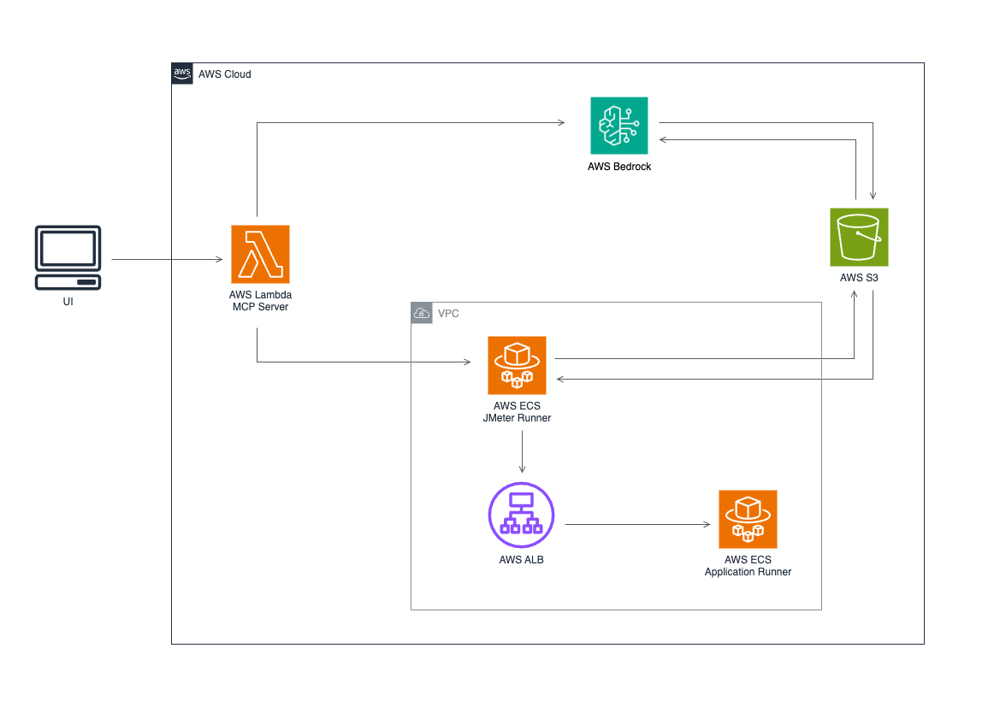

# Performance Testing Pattern - AI-Powered JMeter on AWS

## 1. Introduction

A cloud-native performance testing infrastructure that uses AI to generate and execute JMeter test plans on AWS. The solution automatically analyzes your API specifications, creates comprehensive test scenarios, generates executable JMeter code, and provides intelligent performance insights using Claude 3.7 Sonnet.

**Key Features:**
- **🤖 AI-Generated Test Plans**: Automated JMeter test creation from API specifications
- **☁️ Cloud-Native Execution**: Runs on AWS ECS Fargate with no local setup required
- **� RIntelligent Analysis**: AI-powered performance insights and recommendations
- **�  Reusable Infrastructure**: Deploy once, test any application
- **🛡️ Enterprise Security**: VPC isolation, IAM-based authentication, least-privilege permissions

## 2. Solution Architecture

The solution consists of the following components deployed on AWS:



### Architecture Components

1. **VPC Infrastructure**: Isolated network with public/private subnets (`10.0.0.0/16`)
2. **ECS Fargate Cluster**: Runs JMeter containers and demo applications
3. **Lambda Function**: MCP server with 6 AI-powered performance testing tools
4. **Application Load Balancers**: Internal (for testing) and external (for Streamlit UI)
5. **S3 Storage**: Test artifacts, results, and analysis reports
6. **Security Groups**: Least-privilege network access controls
7. **Service Discovery**: Internal DNS for service-to-service communication

### Workflow Steps

1. **Analyze Architecture**: AI parses your API documentation and system architecture
2. **Generate Scenarios**: Creates realistic test scenarios based on user workflows and NFRs
3. **Generate Test Plans**: Converts scenarios into executable JMeter Java DSL code
4. **Execute Tests**: Runs JMeter containers on ECS Fargate against your application
5. **Collect Artifacts**: Stores all test results and logs in S3
6. **Analyze Results**: AI provides performance insights and recommendations

## 3. Prerequisites

```bash
aws --version        # AWS CLI v2+
docker --version     # Docker Desktop
node --version       # Node.js 18+
python3 --version    # Python 3.8+
cdk --version        # AWS CDK 2.x
npm install -g aws-cdk
aws configure        # Enter AWS credentials
```

## 4. Deployment instructions
```bash
git clone https://github.com/aws-samples/sample-ai-powered-sdlc-patterns-with-aws/tree/main
cd testing/test-api-performance-testing-mcp

# 1. Deploy infrastructure (includes MCP Lambda function)
cd infrastructure-cdk
pip install -r requirements.txt
cdk bootstrap  # Only needed once per account/region
cdk deploy PerformanceTestingStack

# 2. Deploy demo application
cd ..
./deploy-app.sh --app-dir ./fake-api-service --app-name fake-api

# 3. Deploy Streamlit dashboard (optional)
# ⚠️  IMPORTANT: Update your IP address for Streamlit access
# Edit infrastructure-cdk/stacks/streamlit_stack.py line ~95:
# Change cidr_ip="<youripaddress>" to your current IP address
# Or use cidr_ip="0.0.0.0/0" for public access (less secure)

# Get the required values from CloudFormation stack
aws cloudformation describe-stacks --stack-name PerformanceTestingStack --query 'Stacks[0].Outputs[?OutputKey==`MCPServerFunctionURL`].OutputValue' --output text
aws cloudformation describe-stacks --stack-name PerformanceTestingStack --query 'Stacks[0].Outputs[?OutputKey==`S3BucketName`].OutputValue' --output text
aws cloudformation describe-stacks --stack-name PerformanceTestingStack --query 'Stacks[0].Outputs[?OutputKey==`VPCId`].OutputValue' --output text

# Export the values (replace with actual values from above commands)
export MCP_FUNCTION_URL="https://your-function-url.lambda-url.us-west-2.on.aws/"
export ARTIFACT_BUCKET="performance-testing-123456789-us-west-2"
export VPC_ID="vpc-0123456789abcdef0"

# Deploy Streamlit stack
cdk deploy StreamlitStack --app "python3 streamlit_app.py"
```

**Note:** For Streamlit deployment, update your IP address in `infrastructure-cdk/stacks/streamlit_stack.py` lines 217-223:

```python
# Add ingress rule restricted to your IP address
streamlit_alb_ingress = ec2.CfnSecurityGroupIngress(
    self, "StreamlitALBIngressRule",
    group_id=self.streamlit_alb_security_group.security_group_id,
    ip_protocol="tcp",
    from_port=80,
    to_port=80,
    cidr_ip="<youripaddress>",  # ← CHANGE THIS LINE
    description="HTTP access for Streamlit ALB - restricted to specific IP"
)
```

**Option 1: Restrict to Your IP (Recommended)**
```bash
# Get your current IP first:
curl -s https://checkip.amazonaws.com

# Replace line 223 with your IP:
cidr_ip="YOUR.IP.ADDRESS.HERE/32",  # Replace with your actual IP
```

**Option 2: Public Access (Less Secure)**
```python
# Replace line 223 with:
cidr_ip="0.0.0.0/0",  # ⚠️ WARNING: This allows access from anywhere
```

## 5. Test

### **🛠️ Available Tools**

The MCP server provides 6 powerful tools that work together:

#### **1. 🏗️ `analyze_architecture`**
**Purpose**: Parse and understand system architecture documents

```json
{
  "name": "analyze_architecture",
  "arguments": {
    "documents_path": "s3://bucket/architecture-docs/",
    "session_id": "arch-analysis-001"
  }
}
```

**What it does:**
- Analyzes architecture diagrams, API specs, system documentation
- Identifies components, data flows, and integration points
- Creates a structured understanding of your system
- Stores analysis results for subsequent tools

#### **2. 📋 `generate_test_scenarios`**
**Purpose**: Create comprehensive test scenarios based on architecture analysis

```json
{
  "name": "generate_test_scenarios", 
  "arguments": {
    "session_id": "arch-analysis-001",
    "workflow_apis": [
      {"endpoint": "/api/auth/login", "method": "POST", "order": 1},
      {"endpoint": "/api/users/profile", "method": "GET", "order": 2},
      {"endpoint": "/api/orders", "method": "POST", "order": 3}
    ],
    "nfrs": {
      "response_time_p95": "500ms",
      "throughput": "1000rps", 
      "availability": "99.9%",
      "error_rate": "<1%"
    },
    "scenario_types": ["load", "stress", "spike"]
  }
}
```

**What it does:**
- Generates realistic user workflows and test scenarios
- Creates load patterns (ramp-up, steady-state, ramp-down)
- Defines test data and user behavior patterns
- Considers NFRs to set appropriate test parameters

#### **3. ⚙️ `generate_test_plans`**
**Purpose**: Convert scenarios into executable JMeter Java DSL code

```json
{
  "name": "generate_test_plans",
  "arguments": {
    "session_id": "arch-analysis-001",
    "output_format": "java_dsl"
  }
}
```

**What it does:**
- Converts test scenarios into compilable JMeter Java DSL code
- Creates proper HTTP samplers, thread groups, and assertions
- Includes realistic think times and error handling
- Generates multiple test plans (load, stress, spike tests)

#### **4. 🚀 `execute_performance_test`**
**Purpose**: End-to-end test execution on AWS ECS Fargate

```json
{
  "name": "execute_performance_test",
  "arguments": {
    "session_id": "arch-analysis-001",
    "execution_environment": {
      "cluster_name": "performance-testing-cluster",
      "task_definition": "jmeter-runner-corrected",
      "target_url": "my-app.performance-testing.local:3000"
    },
    "monitoring_config": {
      "metrics": ["response_time", "throughput", "error_rate"],
      "duration": "10m"
    }
  }
}
```

**What it does:**
- Launches JMeter containers on ECS Fargate
- Executes all generated test plans in parallel
- Monitors test execution and collects metrics
- Uploads results to S3 for analysis

#### **5. 📊 `get_test_artifacts`**
**Purpose**: List and retrieve test artifacts for a session

```json
{
  "name": "get_test_artifacts",
  "arguments": {
    "session_id": "arch-analysis-001", 
    "artifact_type": "results"
  }
}
```

**What it does:**
- Lists all artifacts for a test session (plans, results, scenarios, analysis)
- Retrieves test results, reports, and logs from S3
- Provides S3 URLs for downloading artifacts
- Supports filtering by artifact type: `all`, `scenarios`, `plans`, `results`
- Shows file sizes, modification dates, and organized categories

#### **6. 🧠 `analyze_test_results`**
**Purpose**: AI-powered analysis of performance test results with intelligent insights

```json
{
  "name": "analyze_test_results",
  "arguments": {
    "session_id": "arch-analysis-001"
  }
}
```

**What it does:**
- Analyzes JMeter result files (.jtl) using AI
- Generates comprehensive performance insights and recommendations
- Provides statistical analysis (response times, throughput, error rates)
- Identifies performance bottlenecks and scalability issues
- Assigns performance grades (A-F scale)
- Offers actionable optimization recommendations
- Creates executive summaries for stakeholders

### **🔄 Complete Workflow Example**

```bash
# 1. Analyze your system architecture
curl -X POST https://your-mcp-server-url \
  -H "Content-Type: application/json" \
  --aws-sigv4 "aws:amz:us-east-1:lambda" \
  -d '{
    "jsonrpc": "2.0",
    "method": "tools/call",
    "params": {
      "name": "analyze_architecture",
      "arguments": {
        "documents_path": "s3://my-bucket/api-docs/",
        "session_id": "ecommerce-test-001"
      }
    }
  }'

# 2. Generate test scenarios
curl -X POST https://your-mcp-server-url \
  -H "Content-Type: application/json" \
  --aws-sigv4 "aws:amz:us-east-1:lambda" \
  -d '{
    "jsonrpc": "2.0", 
    "method": "tools/call",
    "params": {
      "name": "generate_test_scenarios",
      "arguments": {
        "session_id": "ecommerce-test-001",
        "workflow_apis": [
          {"endpoint": "/api/auth/login", "method": "POST"},
          {"endpoint": "/api/products", "method": "GET"},
          {"endpoint": "/api/cart/add", "method": "POST"},
          {"endpoint": "/api/checkout", "method": "POST"}
        ],
        "nfrs": {
          "response_time_p95": "300ms",
          "throughput": "500rps",
          "error_rate": "<0.5%"
        },
        "scenario_types": ["load", "stress"]
      }
    }
  }'

# 3. Generate executable test plans
curl -X POST https://your-mcp-server-url \
  -H "Content-Type: application/json" \
  --aws-sigv4 "aws:amz:us-east-1:lambda" \
  -d '{
    "jsonrpc": "2.0",
    "method": "tools/call", 
    "params": {
      "name": "generate_test_plans",
      "arguments": {
        "session_id": "ecommerce-test-001"
      }
    }
  }'

# 4. Execute performance tests
curl -X POST https://your-mcp-server-url \
  -H "Content-Type: application/json" \
  --aws-sigv4 "aws:amz:us-east-1:lambda" \
  -d '{
    "jsonrpc": "2.0",
    "method": "tools/call",
    "params": {
      "name": "execute_performance_test", 
      "arguments": {
        "session_id": "ecommerce-test-001",
        "execution_environment": {
          "target_url": "my-ecommerce-app.performance-testing.local:3000"
        }
      }
    }
  }'

# 5. Get test artifacts and results
curl -X POST https://your-mcp-server-url \
  -H "Content-Type: application/json" \
  --aws-sigv4 "aws:amz:us-east-1:lambda" \
  -d '{
    "jsonrpc": "2.0",
    "method": "tools/call",
    "params": {
      "name": "get_test_artifacts",
      "arguments": {
        "session_id": "ecommerce-test-001",
        "artifact_type": "all"
      }
    }
  }'

# 6. Get AI-powered performance analysis
curl -X POST https://your-mcp-server-url \
  -H "Content-Type: application/json" \
  --aws-sigv4 "aws:amz:us-east-1:lambda" \
  -d '{
    "jsonrpc": "2.0",
    "method": "tools/call",
    "params": {
      "name": "analyze_test_results",
      "arguments": {
        "session_id": "ecommerce-test-001"
      }
    }
  }'
```

### **🧠 AI-Powered Analysis**

The MCP server uses **Claude 3.7 Sonnet** to provide intelligent analysis:

- **📊 Performance Insights**: Identifies bottlenecks and performance patterns
- **🎯 NFR Compliance**: Checks if your system meets non-functional requirements  
- **💡 Recommendations**: Suggests optimizations and improvements
- **🔍 Root Cause Analysis**: Helps identify the source of performance issues
- **📈 Trend Analysis**: Compares results across multiple test runs
- **🏆 Performance Grading**: Assigns A-F grades based on industry standards
- **📋 Executive Summaries**: Business-friendly reports for stakeholders
- **⚠️ Risk Assessment**: Identifies potential scalability and reliability risks

### **🎯 Real-World Results**

Here's what the AI analysis provides from actual test runs:

**Performance Summary:**
- ✅ **342,273 total requests** processed across all test scenarios
- ✅ **100% success rate** - zero errors across all tests
- ✅ **Peak throughput**: 443 requests/second under load
- ✅ **Response times**: 239-418ms average (well within SLA)

**AI Insights Example:**
```
🎯 Performance Grade: A
📊 System handled 342K+ requests with 0% error rate
💡 Recommendations:
   • Response times are consistent across load levels
   • System shows excellent scalability characteristics  
   • Consider caching for sub-200ms response times
⚠️ Risk Assessment: Low - System demonstrates high reliability
```

### **🔒 Security & Authentication**

- **IAM Authentication**: Uses AWS Signature V4 for secure access
- **VPC Isolation**: Runs in private subnets with no internet access
- **Least Privilege**: Minimal IAM permissions for each component
- **Encrypted Storage**: All artifacts encrypted at rest in S3
- **Audit Logging**: Complete audit trail in CloudWatch

### **⚡ Performance & Scalability**

- **Serverless**: Scales automatically based on demand
- **Rate Limited**: Built-in rate limiting for Bedrock API calls
- **Parallel Execution**: Multiple test plans run simultaneously
- **Resource Efficient**: Only pays for actual usage
- **Global**: Can be deployed in any AWS region

### Key Features

- **🤖 AI-Powered**: Uses Claude 3.7 Sonnet for intelligent test generation
- **☁️ Serverless**: No infrastructure to manage, scales automatically
- **🔒 Secure**: IAM authentication, VPC isolation, encrypted storage
- **📊 Comprehensive**: Supports load, stress, spike, and endurance testing
- **🔄 Reusable**: Deploy once, test any application
- **📈 Insightful**: AI analyzes results and provides actionable recommendations

### Current Limitations

This performance testing pattern is not production-ready, there are some current limitations to be aware of:

### **📊 Large JTL File Processing**

**Issue**: The results analyzer loads entire JTL files into Lambda memory, which can cause issues with large-scale tests.

- **Small tests** (< 10K requests, ~2-5MB JTL): ✅ Works perfectly
- **Medium tests** (10K-100K requests, ~20-50MB JTL): ✅ Works well
- **Large tests** (100K-1M requests, ~200-500MB JTL): ⚠️ May hit memory limits
- **Enterprise tests** (1M+ requests, ~1GB+ JTL): ❌ Will likely fail

**Current Workaround**: 
```bash
# Limit test duration or request count for now
execution_environment: {
  "monitoring_config": {
    "duration": "10m"  # Keep tests shorter
  }
}
```

**Planned Fix**: Implement streaming JTL processing and statistical sampling.

### **🔄 Lambda Timeout Constraints**

**Issue**: Lambda functions have a 15-minute maximum timeout, which can limit:

- **AI analysis time** for very complex results
- **Test plan generation** for large architectures
- **Bedrock API calls** during high-demand periods

**Current Workaround**: Tests are designed to complete within timeout limits.

**Planned Fix**: Move long-running analysis to ECS tasks or Step Functions.

### **💰 Bedrock Rate Limits**

**Issue**: AWS Bedrock has rate limits that can affect:

- **Concurrent test generations** (50 requests/minute default)
- **Large batch analysis** operations
- **Multiple simultaneous users**

**Current Workaround**: Built-in rate limiting with exponential backoff.

**Planned Fix**: Request quota increases and implement request queuing.

### **🌐 Network Connectivity**

**Issue**: JMeter containers run in private subnets and can only test:

- **Internal ALB targets** ✅ (recommended)
- **Service discovery endpoints** ✅ (e.g., `app.performance-testing.local`)
- **Private IP addresses** ✅ (within VPC)
- **External internet endpoints** ❌ (no NAT Gateway by default)

**Current Workaround**: Use internal ALB or deploy target apps in the same VPC.

**Planned Fix**: Optional NAT Gateway deployment for external testing.

## 6. Clean up

To avoid ongoing charges, clean up the resources when you're done:

```bash
# Delete Streamlit stack (if deployed)
cdk destroy StreamlitStack

# Delete main performance testing stack
cdk destroy PerformanceTestingStack

# Clean up any remaining ECR images (optional)
aws ecr list-repositories --query 'repositories[?starts_with(repositoryName, `fake-api`) || starts_with(repositoryName, `streamlit-mcp`)].repositoryName' --output text | xargs -I {} aws ecr delete-repository --repository-name {} --force
```

## 7. Security

This solution implements several security best practices:

- **VPC Isolation**: All resources run in private subnets with no direct internet access
- **IAM Least Privilege**: Each component has minimal required permissions
- **Security Groups**: Restrictive network access controls
- **Encryption**: S3 buckets use server-side encryption
- **Access Logging**: ALB and S3 access logs for audit trails
- **IP Restrictions**: Streamlit ALB can be restricted to specific IP addresses

For production use, consider additional security measures:
- Enable AWS Config for compliance monitoring
- Implement AWS WAF for web application protection
- Use AWS Secrets Manager for sensitive configuration
- Enable VPC Flow Logs for network monitoring
- Implement AWS CloudTrail for API audit logging

See CONTRIBUTING for more information.

## 8. License

This library is licensed under the MIT-0 License. See the LICENSE file.

## 9. Disclaimer

The solution architecture sample code is provided without any guarantees, and you're not recommended to use it for production-grade workloads. The intention is to provide content to build and learn. Be sure of reading the licensing terms.